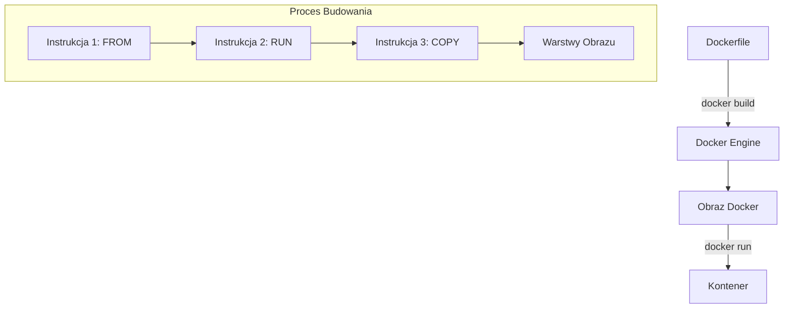
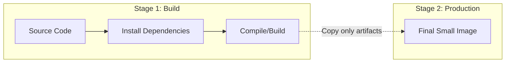

# Kompletny Przewodnik po Dockerfile: Budowanie Obrazów Aplikacji

Ten przewodnik zawiera szczegółowe informacje na temat tworzenia plików `Dockerfile`, wyjaśnienie kluczowych instrukcji, przykłady dla różnych technologii oraz instrukcję wdrożenia na platformy Render.com oraz Leapcell.io.

---

## 1. Co to jest Dockerfile?

**Dockerfile** to plik tekstowy zawierający listę komend, które Docker wykonuje w celu zbudowania obrazu. Każda komenda tworzy nową warstwę w obrazie, co pozwala na optymalizację i ponowne wykorzystanie cache'u.

### Architektura procesu budowania



---

## 2. Kluczowe Instrukcje Dockerfile

| Instrukcja | Opis | Przykład |
| :--- | :--- | :--- |
| `FROM` | Definiuje obraz bazowy (zawsze pierwsza linia). | `FROM php:8.2-apache`, `FROM python:3.11-slim` lub `FROM node:20-slim` |
| `WORKDIR` | Ustawia katalog roboczy dla kolejnych instrukcji. | `WORKDIR /app` |
| `COPY` / `ADD` | Kopiuje pliki z hosta do obrazu. | `COPY package.json .` |
| `RUN` | Wykonuje komendy w trakcie budowania obrazu. | `RUN npm install` lub `RUN pip install -r requirements.txt` |
| `ENV` | Ustawia zmienne środowiskowe. | `ENV NODE_ENV=production` |
| `EXPOSE` | Dokumentuje porty, na których nasłuchuje aplikacja. | `EXPOSE 80` |
| `CMD` | Domyślna komenda uruchamiana przy starcie kontenera. | `CMD ["apache2-foreground"]` |
| `ENTRYPOINT` | Główna komenda, której nie można łatwo nadpisać. | `ENTRYPOINT ["php", "artisan", "serve"]` |

---

## 3. Przykład: Konteneryzacja Aplikacji PHP (Apache)

Poniżej znajduje się przykład optymalnego pliku `Dockerfile` dla prostej aplikacji PHP.

```dockerfile
# 1. Obraz bazowy z PHP i Apache
FROM php:8.2-apache

# 2. Instalacja zależności systemowych i rozszerzeń PHP
RUN apt-get update && apt-get install -y \
    libpng-dev \
    libonig-dev \
    libxml2-dev \
    zip \
    unzip \
    && docker-php-ext-install pdo_mysql mbstring exif pcntl bcmath gd

# 3. Włączenie modułu mod_rewrite dla Apache (wymagane np. przez Laravel)
RUN a2enmod rewrite

# 4. Ustawienie katalogu roboczego
WORKDIR /var/www/html

# 5. Kopiowanie plików aplikacji
COPY . /var/www/html

# 6. Ustawienie uprawnień dla serwera Apache
RUN chown -R www-data:www-data /var/www/html

# 7. Informacja o porcie
EXPOSE 80

# 8. Start Apache w trybie pierwszoplanowym
CMD ["apache2-foreground"]
```

---

## 4. Przykład: Konteneryzacja Aplikacji Python (Flask/Django)

W przypadku Pythona kluczowe jest zarządzanie zależnościami oraz unikanie tworzenia plików `.pyc`.

```dockerfile
# 1. Obraz bazowy
FROM python:3.11-slim

# 2. Ustawienie zmiennych środowiskowych
# Nie twórz plików .pyc
ENV PYTHONDONTWRITEBYTECODE=1
# Nie buforuj wyjścia (logi widoczne natychmiast)
ENV PYTHONUNBUFFERED=1

# 3. Ustawienie katalogu roboczego
WORKDIR /app

# 4. Instalacja zależności systemowych (jeśli potrzebne, np. dla psycopg2)
RUN apt-get update && apt-get install -y \
    gcc \
    libpq-dev \
    && rm -rf /var/lib/apt/lists/*

# 5. Instalacja zależności Pythona
# Kopiujemy najpierw tylko plik requirements.txt, aby wykorzystać cache Dockera
COPY requirements.txt .
RUN pip install --no-cache-dir -r requirements.txt

# 6. Kopiowanie reszty kodu aplikacji
COPY . .

# 7. Port aplikacji
EXPOSE 8000

# 8. Uruchomienie aplikacji (przykład dla Gunicorn)
CMD ["gunicorn", "--bind", "0.0.0.0:8000", "myproject.wsgi:application"]
```

---

## 5. Przykład: Konteneryzacja Aplikacji JavaScript (Node.js)

Dla aplikacji Node.js kluczowe jest rozdzielenie instalacji zależności od kopiowania kodu źródłowego, aby uniknąć zbędnego przeinstalowywania pakietów.

```dockerfile
# 1. Obraz bazowy
FROM node:20-slim

# 2. Ustawienie katalogu roboczego
WORKDIR /app

# 3. Kopiowanie plików definicji pakietów
# Dzięki temu 'npm install' wykona się tylko przy zmianie tych plików
COPY package*.json ./

# 4. Instalacja zależności
# --only=production pomija devDependencies
RUN npm install --only=production

# 5. Kopiowanie reszty kodu aplikacji
COPY . .

# 6. Ustawienie portu
EXPOSE 3000

# 7. Uruchomienie aplikacji
CMD ["node", "index.js"]
```

---

## 6. Optymalizacja Obrazów: Multi-stage Build

Aby obrazy były mniejsze, warto stosować wieloetapowe budowanie.



**Przykład PHP z Composerem:**

```dockerfile
# ETAP 1: Instalacja zależności
FROM composer:latest AS vendor
WORKDIR /app
COPY composer.json composer.lock ./
RUN composer install --no-dev --no-scripts --no-autoloader

# ETAP 2: Obraz końcowy
FROM php:8.2-apache
WORKDIR /var/www/html
# Kopiujemy tylko folder vendor z poprzedniego etapu
COPY --from=vendor /app/vendor ./vendor
COPY . .
```

**Przykład Python (Venv Transfer):**

```dockerfile
# ETAP 1: Budowanie venv
FROM python:3.11-slim AS builder
WORKDIR /app
RUN python -m venv /opt/venv
ENV PATH="/opt/venv/bin:$PATH"
COPY requirements.txt .
RUN pip install --no-cache-dir -r requirements.txt

# ETAP 2: Obraz końcowy
FROM python:3.11-slim
WORKDIR /app
# Kopiujemy tylko zbudowane środowisko venv z poprzedniego etapu
COPY --from=builder /opt/venv /opt/venv
ENV PATH="/opt/venv/bin:$PATH"
COPY . .
CMD ["python", "main.py"]
```

**Przykład Frontend (React + Nginx):**

Wieloetapowe budowanie jest idealne dla aplikacji frontendowych, gdzie potrzebujemy Node.js tylko do zbudowania plików statycznych, a serwujemy je przez lekki serwer WWW.

```dockerfile
# ETAP 1: Budowanie (Build)
FROM node:20-slim AS build
WORKDIR /app
COPY package*.json ./
RUN npm install
COPY . .
RUN npm run build

# ETAP 2: Produkcja (Serve)
FROM nginx:stable-alpine
# Kopiujemy tylko zbudowane pliki statyczne do katalogu Nginx
COPY --from=build /app/dist /usr/share/nginx/html
EXPOSE 80
CMD ["nginx", "-g", "daemon off;"]
```

---

## 7. Wdrożenie na Render.com lub Leapcell.io przy użyciu Dockerfile

Zarówno Render.com, jak i Leapcell.io pozwalają na łatwe wdrażanie aplikacji bezpośrednio z obrazów Docker.

### Krok 1: Przygotowanie Projektu
Upewnij się, że Twój `Dockerfile` jest w głównym katalogu projektu. Twoja aplikacja musi nasłuchiwać na porcie zdefiniowanym przez zmienną środowiskową `PORT` (obie platformy przypisują go dynamicznie).

### Krok 2: Konfiguracja (Render)
1. Zaloguj się na [dashboard.render.com](https://dashboard.render.com).
2. Kliknij **New +** i wybierz **Web Service**.
3. Połącz swoje repozytorium (GitHub/GitLab).
4. W sekcji **Runtime** wybierz **Docker**.

### Krok 2: Konfiguracja (Leapcell)
1. Zaloguj się na [leapcell.io](https://leapcell.io).
2. Stwórz nowy projekt i połącz go z repozytorium GitHub.
3. Wybierz wdrożenie typu **Docker**.
4. Leapcell automatycznie wykryje `Dockerfile` i rozpocznie budowanie.

### Krok 3: Obsługa Zmiennej PORT (Ważne!)
W przypadku PHP (Apache), domyślnie serwer działa na porcie 80. Obie platformy oczekują, że aplikacja będzie "rozmawiać" na porcie, który one wskażą.

Jeśli używasz obrazu `php:apache`, najprościej jest po prostu pozwolić platformie przekierować ruch (Render/Leapcell automatycznie wykrywają port 80 w obrazie Docker).

Jeśli używasz **PHP Built-in Server** lub **Node.js/Python**, upewnij się, że startujesz aplikację na `0.0.0.0:$PORT`:

```dockerfile
# Przykład dla prostej aplikacji PHP bez Apache (wbudowany serwer)
CMD php -S 0.0.0.0:$PORT
```

### Dlaczego warto używać Dockera na Render / Leapcell?
- **Przewidywalność:** Dokładnie te same biblioteki co lokalnie.
- **Własne pakiety:** Możesz zainstalować specyficzne biblioteki systemowe (np. `imagemagick`), których standardowe środowiska mogą nie mieć.
- **Niezależność od wersji:** Sam decydujesz, czy używasz PHP 7.4, 8.2 czy 8.3.

---

## 8. Najlepsze Praktyki (Best Practices)

1. **Używaj `.dockerignore`:** Nie kopiuj folderów `node_modules`, `.git`, `__pycache__` czy `vendor` z lokalnego komputera.
2. **Kolejność instrukcji:** Kopiuj pliki zależności (`package.json`, `composer.json`, `requirements.txt`) przed kopiowaniem całego kodu – przyspiesza to budowanie obrazu (cache).
3. **Specyficzne tagi:** Zamiast `latest`, używaj konkretnych wersji (np. `node:20-slim`, `python:3.11-slim`, `php:8.2-apache`) dla stabilności i mniejszego rozmiaru.
4. **Minimalizm:** Używaj wersji `-slim` lub `alpine`, jeśli to możliwe (mniejszy rozmiar i mniejsza liczba podatności).
5. **Obsługa sygnałów:** W aplikacjach Node.js unikaj uruchamiania przez `npm start` jako `CMD`, ponieważ `npm` nie przekazuje poprawnie sygnałów zamknięcia (SIGTERM). Używaj `CMD ["node", "index.js"]`.
