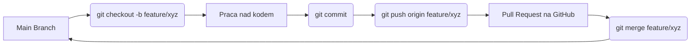

# Laboratorium 1: Git, GitHub i przygotowanie środowiska Django

## Czas trwania: 6 godzin

### Cel:
Opanowanie systemu kontroli wersji Git, platformy GitHub oraz przygotowanie lokalnego środowiska programistycznego dla wybranego frameworka (np. Django, React, itp.). Szczególny nacisk położono na poprawne dokumentowanie pracy przy użyciu Markdown oraz konfigurację bezpiecznego dostępu przez SSH. Przed rozpoczęciem zapoznaj się z listą wymaganych kont w pliku [before_you_start.md](before_you_start.md).

> **Ważne:** Przykłady zadań bazują na Django, ponieważ jest to technologia wybrana przez prowadzącego do prezentacji. Studenci mogą jednak realizować laboratoria w dowolnej, preferowanej przez siebie technologii.  
> Wszędzie zamiast Django należy korzystać z technologii, którą się wybrało. W przypadku wyboru innego frameworka, należy odpowiednio skonfigurować plik `.gitignore` oraz treść pliku workflow w GitHub Actions, tak aby były one dopasowane do wybranej technologii.
> 
> **Wymagania ogólne:** 
> * Konieczna jest realizacja (użycie) wszystkich punktów 1-6 opisanych w tym laboratorium.
> * Należy stworzyć co najmniej dwie dodatkowe gałęzie (branches) oprócz głównej (`main`) i ich nie usuwać z repozytorium na GitHubie.  
> * Do każdego laboratorium należy sporządzić sprawozdanie w formacie PDF (np. w produktach JetBrains mamy opcję 'Tools->Markdown->Export to PDF').  

### Zadania i ćwiczenia:

#### 0. Wiedza teoretyczna w pigułce
*   **Git** to rozproszony system kontroli wersji. "Rozproszony" oznacza, że nie potrzebujesz stałego połączenia z serwerem, aby robić commity, przeglądać historię czy tworzyć gałęzie.
*   **SSH (Secure Shell)** to protokół używany do bezpiecznej komunikacji. Wykorzystuje asymetryczną kryptografię (klucz publiczny i prywatny). Klucz publiczny wgrywasz na GitHub, a prywatny trzymasz bezpiecznie na swoim komputerze.
*   **Wirtualne środowisko (venv)** izoluje zależności Twojego projektu. Dzięki temu różne projekty mogą używać różnych wersji tych samych bibliotek (np. Django 4.2 i Django 5.0) na tym samym komputerze bez konfliktów.

1. **Konfiguracja środowiska i Markdown (2h):**
   - Instalacja Git oraz Python.
   - Konfiguracja nazwy użytkownika i emaila w Git.
   - **Generowanie kluczy SSH:**
     1. Otwórz terminal i wpisz: `ssh-keygen -t ed25519 -C "twój_email@example.com"`.
     2. Zaakceptuj domyślną lokalizację pliku.
     3. Skopiuj zawartość pliku publicznego: `cat ~/.ssh/id_ed25519.pub`.
     4. Dodaj klucz w ustawieniach GitHub (Settings -> SSH and GPG keys).
   - **Zadanie Markdown:** Stwórz plik `README.md` w swoim folderze roboczym. Użyj nagłówków, list, pogrubienia, kodu inline oraz dodaj link do oficjalnej dokumentacji Django.

| Narzędzie | Komenda | Opis |
| :--- | :--- | :--- |
| **Git** | `git config --global user.name "Twoje Imie"` | Konfiguracja tożsamości |
| **Venv** | `python -m venv venv` | Tworzenie izolowanego środowiska |
| **Pip** | `pip install django` | Instalacja frameworka |
| **Django** | `django-admin startproject core .` | Inicjalizacja projektu |

2. **Inicjalizacja projektu Django i Git (2h):**
   - Utworzenie nowego projektu: `django-admin startproject core .`.
   - Inicjalizacja repozytorium: `git init`.
   - **Stworzenie pliku `.gitignore`:** Wykorzystaj `gitignore.io` lub stwórz plik ręcznie. Musi on zawierać co najmniej:
     ```text
     # Środowisko wirtualne
     venv/
     ENV/
     
     # Cache Pythona
     **/__pycache__/
     *.py[cod]
     
     # Baza danych (lokalna)
     db.sqlite3
     
     # Pliki IDE
     .vscode/
     .idea/
     ```
   - Pierwszy commit: "Initial commit: Django project structure".

**Struktura plików projektu Django:**
```text
.
├── core/               # Ustawienia główne projektu
│   ├── __init__.py
│   ├── asgi.py
│   ├── settings.py     # Konfiguracja (baza danych, zainstalowane aplikacje)
│   ├── urls.py         # Główny routing aplikacji
│   └── wsgi.py         # Interfejs serwera aplikacji
├── manage.py           # Narzędzie CLI do zarządzania projektem
├── .gitignore          # Pliki ignorowane przez Git
└── requirements.txt    # Lista zależności projektu
```

3. **Praca z gałęziami i podstawowa logika (3h):**
   - Tworzenie gałęzi `feature/initial-setup`.
   - Stworzenie pierwszej aplikacji lub modułu (np. `python manage.py startapp base` dla Django).
   - Rejestracja aplikacji w ustawieniach projektu.
   - Scalanie zmian do gałęzi `main`.
   - **Uwaga:** Musisz stworzyć i zachować co najmniej dwie gałęzie typu `feature/` (lub inne pomocnicze) w swoim repozytorium. Nie usuwaj ich po scaleniu.

**Diagram przepływu pracy w Git (Feature Branch Workflow):**


4. **Współpraca z GitHub (3h):**
   - Tworzenie zdalnego repozytorium na GitHub (nie dodawaj README ani .gitignore na GitHubie - mamy je już lokalnie).
   - Połączenie lokalnego repozytorium ze zdalnym: `git remote add origin git@github.com:użytkownik/nazwa-repo.git`.
   - Operacje `push`, `pull`.
   - Wykorzystanie GitHub Issues do zaplanowania kolejnych etapów projektu.

5. **Symulacja konfliktu (1h):**
   - Na GitHubie wyedytuj plik `README.md` bezpośrednio w przeglądarce i zatwierdź zmiany.
   - W lokalnym repozytorium (na tym samym pliku, w tej samej linii) wprowadź inną zmianę i spróbuj zrobić `git commit` oraz `git push`.
   - Git zablokuje push. Wykonaj `git pull`. Powstanie konflikt.
   - Rozwiąż konflikt ręcznie, wybierając pożądaną wersję tekstu, wykonaj `git add README.md` i `git commit`.

6. **Automatyzacja z GitHub Actions (2h):**
   - Utworzenie w głównym folderze projektu struktury katalogów: `.github/workflows/`.
   - Stworzenie pliku `django_check.yml` o następującej treści (weryfikacja składni):
     ```yaml
     name: Django Syntax Check
     on: [push]
     jobs:
       lint:
         runs-on: ubuntu-latest
         steps:
           - uses: actions/checkout@v4
           - name: Set up Python
             uses: actions/setup-python@v5
             with:
               python-version: '3.10'
           - name: Install flake8
             run: pip install flake8
           - name: Run linting
             run: flake8 . --count --select=E9,F63,F7,F82 --show-source --statistics
     ```
   - Wysłanie zmian do repozytorium (`push`) i zaobserwowanie zakładki **Actions** na GitHubie.
   - **Zadanie:** Celowo wprowadź błąd składniowy (np. usuń dwukropek w `urls.py`), wypchnij zmianę i sprawdź, czy GitHub Actions zgłosi błąd (czerwony X).

### Lista kontrolna (Checklist):
- [ ] Czy zrealizowano wszystkie punkty od 1 do 6?
- [ ] Czy zainstalowano odpowiednie narzędzia dla wybranej technologii (np. Python, Node.js, Git)?
- [ ] Czy skonfigurowano klucze SSH i połączenie z GitHub (test: `ssh -T git@github.com`)?
- [ ] Czy projekt uruchamia się lokalnie i wyświetla stronę startową?
- [ ] Czy plik `.gitignore` jest poprawnie skonfigurowany dla Twojej technologii (np. ignoruje środowiska wirtualne, cache, pliki lokalnych baz danych i pliki IDE)?
- [ ] Czy w repozytorium znajdują się co najmniej dwie gałęzie oprócz `main` (np. `feature/setup`, `feature/docs`)?
- [ ] Czy gałęzie pomocnicze nie zostały usunięte po scaleniu?
- [ ] Czy repozytorium na GitHub jest publiczne i zawiera sformatowany plik `README.md`?
- [ ] Czy skonfigurowano GitHub Actions (workflow dopasowany do technologii) i czy testy przechodzą (zielony znacznik)?
- [ ] Czy w historii commitów widać co najmniej kilka wpisów o jasnych i zrozumiałych komunikatach?

### Wymagania na zaliczenie:
- Realizacja wszystkich punktów (1-6) instrukcji.
- Utworzenie publicznego repozytorium na GitHub z zainicjalizowanym projektem w wybranej technologii.
- Obecność co najmniej dwóch dodatkowych, nieusuniętych gałęzi w repozytorium.
- Wykazanie się poprawną i czytelną historią commitów.
- Prawidłowo skonfigurowany plik `.gitignore` i GitHub Actions.
