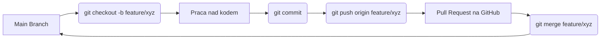

# Laboratorium 1: Git, GitHub i przygotowanie środowiska Django

## Czas trwania: 6 godzin

### Cel:
Opanowanie systemu kontroli wersji Git, platformy GitHub oraz przygotowanie lokalnego środowiska programistycznego dla wybranego frameworka (np. Django, React, itp.). Szczególny nacisk położono na poprawne dokumentowanie pracy przy użyciu Markdown oraz konfigurację bezpiecznego dostępu przez SSH. Przed rozpoczęciem zapoznaj się z listą wymaganych kont w pliku [before_you_start.md](before_you_start.md).

> **Ważne:** Przykłady zadań bazują na Django, ponieważ jest to technologia wybrana przez prowadzącego do prezentacji. Studenci mogą jednak realizować laboratoria w dowolnej, preferowanej przez siebie technologii.  
> Wszędzie zamiast Django należy korzystać z technologii, którą się wybrało. W przypadku wyboru innego frameworka, należy odpowiednio skonfigurować plik `.gitignore` oraz treść pliku workflow w GitHub Actions, tak aby były one dopasowane do wybranej technologii.
> 
> **Wymagania ogólne:** 
> * Konieczna jest realizacja (użycie) wszystkich punktów 1-6 opisanych w tym laboratorium.
> * Należy stworzyć co najmniej dwie dodatkowe gałęzie (branches) oprócz głównej (`main`) i ich nie usuwać z repozytorium na GitHubie.  
> * Do każdego laboratorium należy sporządzić sprawozdanie w formacie PDF (np. w produktach JetBrains mamy opcję 'Tools->Markdown->Export to PDF').  

### Zadania i ćwiczenia:

#### 0. Wiedza teoretyczna w pigułce
*   **Git** to rozproszony system kontroli wersji. "Rozproszony" oznacza, że nie potrzebujesz stałego połączenia z serwerem, aby robić commity, przeglądać historię czy tworzyć gałęzie.
*   **SSH (Secure Shell)** to protokół używany do bezpiecznej komunikacji. Wykorzystuje asymetryczną kryptografię (klucz publiczny i prywatny). Klucz publiczny wgrywasz na GitHub, a prywatny trzymasz bezpiecznie na swoim komputerze.
*   **Wirtualne środowisko (venv)** izoluje zależności Twojego projektu. Dzięki temu różne projekty mogą używać różnych wersji tych samych bibliotek (np. Django 4.2 i Django 5.0) na tym samym komputerze bez konfliktów.

1. **Konfiguracja środowiska i Markdown (2h):**
   - **Instalacja narzędzi:** Upewnij się, że masz zainstalowany Git (`git --version`) oraz Python (`python --version` lub `python3 --version`).
   - **Konfiguracja tożsamości Git:** Wpisz w terminalu swoje dane, które będą widoczne przy każdym commicie:
     ```bash
     git config --global user.name "Twoje Imie i Nazwisko"
     git config --global user.email "twój_email@example.com"
     ```
   - **Generowanie kluczy SSH (bezpieczna komunikacja z GitHubem):**
     1. Otwórz terminal i wpisz: `ssh-keygen -t ed25519 -C "twój_email@example.com"`.
     2. Gdy system zapyta o lokalizację, naciśnij `Enter` (domyślnie `~/.ssh/id_ed25519`).
     3. Opcjonalnie podaj hasło (passphrase) dla dodatkowego bezpieczeństwa.
     4. Wyświetl klucz publiczny: `cat ~/.ssh/id_ed25519.pub`.
     5. Skopiuj całą wyświetloną linię (zaczynającą się od `ssh-ed25519`).
     6. Dodaj klucz na GitHubie: wejdź w `Settings` -> `SSH and GPG keys` -> `New SSH key`. Wklej klucz i nadaj mu nazwę (np. "Laptop-Studia").
     7. Przetestuj połączenie: `ssh -T git@github.com`. Powinieneś zobaczyć komunikat powitalny z Twoim loginem.
   - **Zadanie Markdown:** Stwórz plik `README.md` w swoim folderze roboczym. Plik musi zawierać:
     - Nagłówek poziomu 1 (#) z nazwą projektu.
     - Krótki opis celu laboratorium (pogrubienie: `**tekst**`).
     - Listę punktową z wymaganiami (lista: `* element`).
     - Kod inline (np. `python manage.py runserver`).
     - Link do [oficjalnej dokumentacji Django](https://docs.djangoproject.com/en/stable/).
     - Więcej wskazówek znajdziesz w pliku [markdown_guide.md](../docs/markdown_guide.md).

| Narzędzie | Komenda | Opis |
| :--- | :--- | :--- |
| **Git** | `git config --global user.name "Twoje Imie"` | Konfiguracja tożsamości |
| **Venv** | `python -m venv venv` | Tworzenie izolowanego środowiska |
| **Pip** | `pip install django` | Instalacja frameworka |
| **Django** | `django-admin startproject core .` | Inicjalizacja projektu |

2. **Inicjalizacja projektu i Git (2h):**
   - **Przygotowanie folderu:** Stwórz nowy folder na projekt i wejdź do niego w terminalu.
   - **Wirtualne środowisko (izolacja bibliotek):**
     1. Utwórz venv: `python -m venv venv`.
     2. Aktywuj środowisko:
        - Linux/macOS: `source venv/bin/activate`
        - Windows (CMD): `venv\Scripts\activate`
        - Windows (PowerShell): `.\venv\Scripts\Activate.ps1`
     3. Po aktywacji powinieneś widzieć `(venv)` na początku linii w terminalu.
   - **Instalacja frameworka:** Zainstaluj Django: `pip install django`.
   - **Utworzenie struktury projektu:** Wykonaj `django-admin startproject core .` (kropka na końcu jest ważna - tworzy projekt w bieżącym folderze).
   - **Inicjalizacja Git:** Wykonaj `git init` w głównym folderze projektu.
   - **Zarządzanie zależnościami:** Stwórz plik z listą bibliotek: `pip freeze > requirements.txt`.
   - **Stworzenie pliku `.gitignore`:** Wykorzystaj `gitignore.io` lub stwórz plik ręcznie. Musi on zawierać co najmniej:
     ```text
     # Środowisko wirtualne
     venv/
     ENV/
     
     # Cache Pythona
     **/__pycache__/
     *.py[cod]
     
     # Baza danych (lokalna)
     db.sqlite3
     
     # Pliki IDE
     .vscode/
     .idea/
     ```
   - **Pierwszy commit:** 
     1. Sprawdź status: `git status`.
     2. Dodaj pliki: `git add .`.
     3. Zrób commit: `git commit -m "Initial commit: Django project structure"`.

**Struktura plików projektu Django:**
```text
.
├── core/               # Ustawienia główne projektu
│   ├── __init__.py
│   ├── asgi.py
│   ├── settings.py     # Konfiguracja (baza danych, zainstalowane aplikacje)
│   ├── urls.py         # Główny routing aplikacji
│   └── wsgi.py         # Interfejs serwera aplikacji
├── manage.py           # Narzędzie CLI do zarządzania projektem
├── .gitignore          # Pliki ignorowane przez Git
└── requirements.txt    # Lista zależności projektu
```

3. **Praca z gałęziami i podstawowa logika (3h):**
   - **Tworzenie gałęzi funkcjonalnej:** Utwórz nową gałąź i przełącz się na nią: `git checkout -b feature/initial-setup`.
   - **Stworzenie aplikacji (modułu):** Wykonaj `python manage.py startapp base`. Powstanie nowy folder `base/` z plikami aplikacji.
   - **Rejestracja aplikacji:** 
     1. Otwórz plik `core/settings.py`.
     2. Znajdź listę `INSTALLED_APPS`.
     3. Dodaj `'base',` na końcu listy (pamiętaj o przecinku).
   - **Zapisanie zmian na gałęzi:**
     1. Dodaj zmiany: `git add .`.
     2. Zatwierdź: `git commit -m "Add base application and register it in settings"`.
   - **Scalanie zmian (Merge):**
     1. Przełącz się na główną gałąź: `git checkout main`.
     2. Scal zmiany z gałęzi feature: `git merge feature/initial-setup`.
   - **Uwaga:** Musisz stworzyć i zachować co najmniej dwie gałęzie typu `feature/` (lub inne pomocnicze) w swoim repozytorium. Nie usuwaj ich po scaleniu. Kolejną gałąź stwórz np. przy okazji dodawania dokumentacji lub nowej funkcji.

**Diagram przepływu pracy w Git (Feature Branch Workflow):**


4. **Współpraca z GitHub (3h):**
   - **Tworzenie zdalnego repozytorium:** Wejdź na GitHub, kliknij `New repository`. Nazwij je (np. `integration-lab-1`). **Ważne:** Nie zaznaczaj opcji "Add a README file", "Add .gitignore" ani "Choose a license" - mamy te pliki już lokalnie i ich dodanie na GitHubie stworzyłoby niepotrzebny konflikt na start.
   - **Połączenie lokalnego repozytorium ze zdalnym:**
     1. Skopiuj adres SSH repozytorium (np. `git@github.com:użytkownik/nazwa-repo.git`).
     2. W terminalu wpisz: `git remote add origin ADRES_SSH`.
     3. Ustaw nazwę głównej gałęzi (jeśli nie jest `main`): `git branch -M main`.
   - **Pierwsze wypchnięcie kodu:** `git push -u origin main`. Flaga `-u` (upstream) sprawi, że Git zapamięta powiązanie.
   - **Wypchnięcie pozostałych gałęzi:** Pamiętaj o wysłaniu na serwer swoich gałęzi feature: `git push origin feature/initial-setup`.
   - **Wykorzystanie GitHub Issues:** Stwórz w zakładce `Issues` na GitHubie 2-3 zadania do wykonania w kolejnych laboratoriach (np. "Integracja z zewnętrznym API", "Dodanie autoryzacji").

5. **Symulacja konfliktu (1h):**
   - **Krok 1 (GitHub):** Na GitHubie otwórz plik `README.md` w przeglądarce, kliknij ikonę edycji (ołówek), zmień drugą linię tekstu i zatwierdź zmiany (Commit changes).
   - **Krok 2 (Lokalnie):** W tym samym czasie, w lokalnym repozytorium, otwórz ten sam plik `README.md`. W tej samej (drugiej) linii wpisz coś zupełnie innego. 
   - **Krok 3 (Błąd):** Spróbuj zrobić commit i push:
     ```bash
     git add README.md
     git commit -m "Local change to README"
     git push origin main
     ```
     Git odrzuci operację (`rejected`), ponieważ wersja na serwerze zawiera zmiany, których nie masz lokalnie.
   - **Krok 4 (Rozwiązanie):**
     1. Wykonaj `git pull origin main`. Zobaczysz komunikat o konflikcie (`CONFLICT (content): Merge conflict in README.md`).
     2. Otwórz plik `README.md`. Zobaczysz znaczniki `<<<<<<<`, `=======` oraz `>>>>>>>`.
     3. Usuń znaczniki i wybierz, która wersja tekstu ma zostać (lub połącz obie).
     4. Po naprawieniu pliku wykonaj:
        ```bash
        git add README.md
        git commit -m "Fix merge conflict in README"
        git push origin main
        ```

6. **Automatyzacja z GitHub Actions (2h):**
   - **Przygotowanie struktury:** GitHub szuka plików automatyzacji w konkretnym folderze. W głównym katalogu projektu wykonaj:
     ```bash
     mkdir -p .github/workflows
     ```
   - **Stworzenie pliku workflow:** Stwórz plik `.github/workflows/django_check.yml`. Ten plik będzie uruchamiał "sprawdzarkę" przy każdym wypchnięciu kodu.
   - **Treść pliku (weryfikacja składni):** Skopiuj poniższą treść (uważaj na wcięcia - YAML jest na nie wrażliwy!):
     ```yaml
     name: Django Syntax Check
     on: [push]
     jobs:
       lint:
         runs-on: ubuntu-latest
         steps:
           - uses: actions/checkout@v4
           - name: Set up Python
             uses: actions/setup-python@v5
             with:
               python-version: '3.10'
           - name: Install flake8
             run: pip install flake8
           - name: Run linting
             run: flake8 . --count --select=E9,F63,F7,F82 --show-source --statistics
     ```
   - **Test automatyzacji:** 
     1. Dodaj, zatwierdź i wypchnij plik workflow: `git add .github/workflows/django_check.yml && git commit -m "Add GitHub Actions workflow" && git push`.
     2. Wejdź na GitHub do zakładki `Actions`. Powinieneś zobaczyć uruchomiony proces (pomarańczowe kółko, potem zielony ptaszek).
   - **Symulacja błędu:** Celowo wprowadź błąd składniowy (np. usuń dwukropek w `urls.py` lub zrób błąd w nazwie funkcji), wypchnij zmianę i sprawdź, czy GitHub Actions zgłosi błąd (czerwony X). Pamiętaj, aby naprawić błąd po teście!

### Lista kontrolna (Checklist):
- [ ] Czy zrealizowano wszystkie punkty od 1 do 6?
- [ ] Czy zainstalowano odpowiednie narzędzia dla wybranej technologii (np. Python, Node.js, Git)?
- [ ] Czy skonfigurowano klucze SSH i połączenie z GitHub (test: `ssh -T git@github.com`)?
- [ ] Czy plik `README.md` zawiera nagłówki, listy, pogrubienia oraz linki (zgodnie z zadaniem 1)?
- [ ] Czy projekt uruchamia się lokalnie i wyświetla stronę startową?
- [ ] Czy plik `.gitignore` jest poprawnie skonfigurowany dla Twojej technologii (np. ignoruje środowiska wirtualne, cache, pliki lokalnych baz danych i pliki IDE)?
- [ ] Czy w repozytorium znajdują się co najmniej dwie gałęzie oprócz `main` (np. `feature/setup`, `feature/docs`)?
- [ ] Czy gałęzie pomocnicze nie zostały usunięte po scaleniu i są widoczne na GitHubie?
- [ ] Czy repozytorium na GitHub jest publiczne?
- [ ] Czy skonfigurowano GitHub Actions (workflow dopasowany do technologii) i czy testy przechodzą (zielony znacznik)?
- [ ] Czy celowo wprowadzono błąd w celu przetestowania GitHub Actions (zgodnie z zadaniem 6)?
- [ ] Czy w historii commitów widać co najmniej kilka wpisów o jasnych i zrozumiałych komunikatach?
- [ ] Czy sprawozdanie w formacie PDF zostało przygotowane?

### Wymagania na zaliczenie:
- Realizacja wszystkich punktów (1-6) instrukcji.
- Utworzenie publicznego repozytorium na GitHub z zainicjalizowanym projektem w wybranej technologii.
- Obecność co najmniej dwóch dodatkowych, nieusuniętych gałęzi w repozytorium.
- Wykazanie się poprawną i czytelną historią commitów.
- Prawidłowo skonfigurowany plik `.gitignore` i GitHub Actions.
