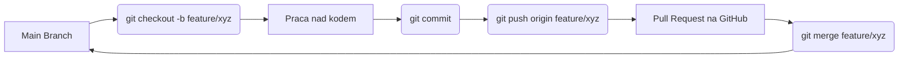

# Laboratorium 1: Git, GitHub i przygotowanie środowiska Django

## Czas trwania: 6 godzin

### Cel:
Opanowanie systemu kontroli wersji Git, platformy GitHub oraz przygotowanie lokalnego środowiska programistycznego dla frameworka Django.

### Zadania i ćwiczenia:
1. **Konfiguracja środowiska (2h):**
   - Instalacja Git oraz Python.
   - Konfiguracja nazwy użytkownika i emaila w Git.
   - Generowanie i dodawanie kluczy SSH do konta GitHub.
   - Tworzenie wirtualnego środowiska (`python -m venv venv`).
   - Instalacja Django (`pip install django`).

| Narzędzie | Komenda | Opis |
| :--- | :--- | :--- |
| **Git** | `git config --global user.name "Twoje Imie"` | Konfiguracja tożsamości |
| **Venv** | `python -m venv venv` | Tworzenie izolowanego środowiska |
| **Pip** | `pip install django` | Instalacja frameworka |
| **Django** | `django-admin startproject core .` | Inicjalizacja projektu |

2. **Inicjalizacja projektu Django i Git (2h):**
   - Utworzenie nowego projektu: `django-admin startproject core .`.
   - Inicjalizacja repozytorium: `git init`.
   - Stworzenie pliku `.gitignore` dedykowanego dla Python/Django (wykorzystaj `gitignore.io`).
   - Pierwszy commit: "Initial commit: Django project structure".

**Struktura plików projektu Django:**
```text
.
├── core/               # Ustawienia główne projektu
│   ├── __init__.py
│   ├── asgi.py
│   ├── settings.py     # Konfiguracja (baza danych, zainstalowane aplikacje)
│   ├── urls.py         # Główny routing aplikacji
│   └── wsgi.py         # Interfejs serwera aplikacji
├── manage.py           # Narzędzie CLI do zarządzania projektem
├── .gitignore          # Pliki ignorowane przez Git
└── requirements.txt    # Lista zależności projektu
```

3. **Praca z gałęziami i podstawowa logika (3h):**
   - Tworzenie gałęzi `feature/initial-setup`.
   - Stworzenie pierwszej aplikacji: `python manage.py startapp base`.
   - Rejestracja aplikacji w `settings.py`.
   - Scalanie zmian do gałęzi `main`.

**Diagram przepływu pracy w Git (Feature Branch Workflow):**


4. **Współpraca z GitHub (3h):**
   - Tworzenie zdalnego repozytorium na GitHub.
   - Połączenie lokalnego repozytorium ze zdalnym (`git remote add origin ...`).
   - Operacje `push`, `pull`.
   - Wykorzystanie GitHub Issues do zaplanowania kolejnych etapów projektu.

### Lista kontrolna (Checklist):
- [ ] Czy zainstalowano Pythona (wersja 3.10+) i Gita?
- [ ] Czy skonfigurowano klucze SSH i połączenie z GitHub?
- [ ] Czy projekt Django uruchamia się lokalnie (`python manage.py runserver`)?
- [ ] Czy plik `.gitignore` zawiera `venv/`, `__pycache__/` oraz `db.sqlite3`?
- [ ] Czy repozytorium na GitHub jest publiczne i zawiera README.md?

### Wymagania na zaliczenie:
- Utworzenie publicznego repozytorium na GitHub z zainicjalizowanym projektem Django.
- Wykazanie się poprawną historią commitów.
- Prawidłowo skonfigurowany plik `.gitignore`.
