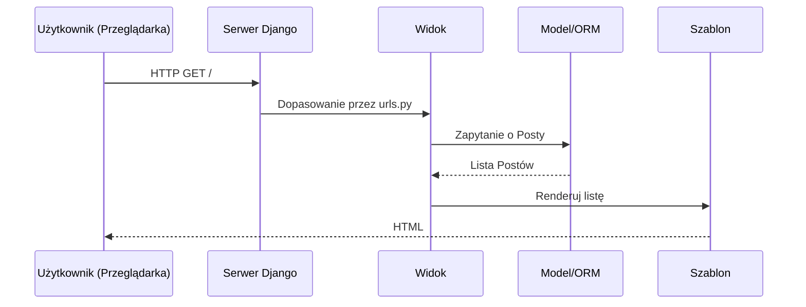
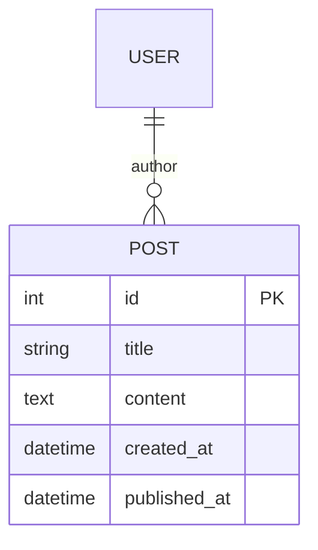

# Laboratorium 2: Lokalna aplikacja Django – System Blogowy (Praca z gałęziami)

## Czas trwania: 6 godzin

### Cel:
Stworzenie lokalnej wersji aplikacji 'Blog' w Django lub Express.js oraz opanowanie pracy na gałęziach (Feature Branch Workflow) w systemie Git.

### Zadania i ćwiczenia:

#### 0. Wiedza teoretyczna w pigułce
- **MVC/MVT:** Django implementuje MVT (Model-Template-View). Express.js pozwala na dowolność, ale często stosuje się w nim klasyczne MVC (Model-View-Controller).
- **ORM / ODM:** Warstwa mapowania obiektowo-relacyjnego (np. Django ORM, Sequelize dla JS) pozwala operować na bazie poprzez obiekty w kodzie.
- **Middleware:** Funkcje w Express.js (i Django), które mają dostęp do obiektu żądania (req), odpowiedzi (res) i następnej funkcji middleware.



1. **Praca na gałęziach (Git Workflow) (1h):**
   - Przed rozpoczęciem pracy stwórz nową gałąź: `git checkout -b feature/blog-app`.
   - Wszystkie zmiany w tym laboratorium powinny trafiać na tę gałąź.

2. **Inicjalizacja aplikacji:**
   - Stworzenie nowej aplikacji: `python manage.py startapp blog`.
   - Rejestracja aplikacji w `settings.py`.
   - **Commit:** "Add blog app to projects and settings".

3. **Definicja modeli (2h):**


   - Stworzenie modelu `Post` z polami: `title`, `content`, `author`, `created_at`, `published_at`.
   - **Django:** Edycja `blog/models.py`, implementacja metody `__str__`.
   - **Express.js:** Wybierz bibliotekę (np. `Sequelize` lub `Mongoose`) i zdefiniuj schemat postu.
   - **Commit:** "Define Post model".

**Przykład modelu w Django (`blog/models.py`):**
```python
from django.db import models
from django.contrib.auth.models import User
from django.utils import timezone

class Post(models.Model):
    title = models.CharField(max_length=200)
    content = models.TextField()
    author = models.ForeignKey(User, on_delete=models.CASCADE)
    created_at = models.DateTimeField(auto_now_add=True)
    published_at = models.DateTimeField(default=timezone.now)

    def __str__(self):
        return self.title
```

**Przykład modelu w Express (Sequelize):**
```javascript
const Post = sequelize.define('Post', {
  title: Sequelize.STRING,
  content: Sequelize.TEXT,
  published_at: {
    type: Sequelize.DATE,
    defaultValue: Sequelize.NOW
  }
});
```

4. **Migracje i Panel Zarządzania (1h):**
   - **Django:** Wykonanie migracji (`makemigrations`, `migrate`) i rejestracja w `admin.py`.
   - **Express.js:** Uruchom synchronizację modeli z bazą danych (np. `sequelize.sync()`) i stwórz prosty formularz do dodawania postów (jako zamiennik panelu admina).
   - **Commit:** "Initialize database and basic administrative access".

5. **Widoki i Szablony (2h):**
   - Stworzenie widoku listy postów i szczegółów postu.
   - **Django:** `ListView`, `DetailView`, szablony w `templates/blog/`.
   - **Express.js:** `router.get('/', ...)`, system szablonów (np. EJS, Pug) lub zwracanie JSON.
   - **Commit:** "Implement basic views and templates for blog posts".

6. **Zarządzanie zmianami i Merge (2h):**
   - Sprawdź status swojej pracy: `git status`.
   - Wypchnij gałąź na GitHub: `git push origin feature/blog-app`.
   - Stwórz **Pull Request** na GitHubie.
   - Zmerguj gałąź `feature/blog-app` do `main` (lokalnie lub przez GitHub).
   - (Opcjonalnie) Dodaj proste testy jednostkowe widoków lub modeli i włącz je do CI (patrz Wykład 2, sekcja Actions).

### Lista kontrolna (Checklist):
- [ ] Czy stworzono i wykorzystano nową gałąź `feature/blog-app`?
- [ ] Czy nowa aplikacja została poprawnie zainicjalizowana i zarejestrowana w głównym projekcie?
- [ ] Czy model `Post` zawiera wszystkie wymagane pola (`title`, `content`, `author`, `created_at`, `published_at`)?
- [ ] Czy poprawnie obsłużono powiązanie posta z autorem (ForeignKey w Django lub asocjacje w Sequelize)?
- [ ] Czy migracje bazy danych zostały wygenerowane i zaaplikowane (sprawdź czy tabela istnieje w bazie)?
- [ ] Czy istnieje możliwość dodawania i edycji postów (Panel Admina w Django lub dedykowane trasy/formularze w Express.js)?
- [ ] Czy stworzono widok listy postów (wszystkie posty) i widok szczegółowy (jeden konkretny post)?
- [ ] Czy routing (URL-e) jest poprawnie skonfigurowany (brak błędów 404 przy nawigacji)?
- [ ] Czy szablony HTML poprawnie wyświetlają dynamiczne dane pobrane z bazy (użycie pętli dla listy)?
- [ ] Czy na GitHubie został stworzony Pull Request z gałęzi `feature/blog-app` do `main`?
- [ ] Czy Pull Request zawiera opis zmian i został zmergowany (lokalnie lub przez WWW)?
- [ ] Czy proces scalania (merge) został odnotowany w historii Git (użyj `git log --graph --oneline`)?
- [ ] Czy każdy commit ma zrozumiały opis i dotyczy konkretnej funkcjonalności?
- [ ] Czy sprawozdanie w formacie PDF zostało przygotowane (zawiera zrzuty ekranu aplikacji i historię Git)?

### Wymagania na zaliczenie:
- Działająca lokalnie aplikacja bloga.
- Historia repozytorium pokazująca pracę na gałęzi i proces scalania.
- Kod zacommitowany zgodnie z dobrymi praktykami.
