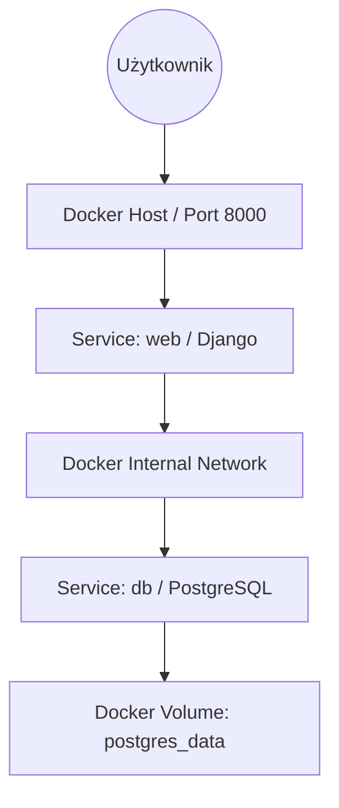

# Laboratorium 4: Wielokontenerowe środowisko Django i PostgreSQL

## Czas trwania: 10 godzin

### Cel:
Integracja aplikacji Django z bazą danych PostgreSQL w ramach jednego projektu przy użyciu Docker Compose.

### Zadania i ćwiczenia:

**Architektura wielokontenerowa:**


1. **Definiowanie usług w Docker Compose (3h):**
   - Stworzenie pliku `docker-compose.yml` w wersji 3.8+.
   - Konfiguracja usługi `db`: obraz `postgres:15`, zmienne `POSTGRES_DB`, `POSTGRES_USER`, `POSTGRES_PASSWORD`.
   - Konfiguracja usługi `web`: budowanie z lokalnego `Dockerfile`, mapowanie portu `8000:8000`.

**Przykładowy `docker-compose.yml`:**
```yaml
version: '3.8'

services:
  db:
    image: postgres:15
    volumes:
      - postgres_data:/var/lib/postgresql/data
    environment:
      - POSTGRES_DB=django_db
      - POSTGRES_USER=django_user
      - POSTGRES_PASSWORD=django_password
    healthcheck:
      test: ["CMD-SHELL", "pg_isready -U django_user -d django_db"]
      interval: 10s
      timeout: 5s
      retries: 5

  web:
    build: .
    command: python manage.py runserver 0.0.0.0:8000
    volumes:
      - .:/app
    ports:
      - "8000:8000"
    environment:
      - DEBUG=True
      - SECRET_KEY=dev_secret_key
      - DATABASE_URL=postgres://django_user:django_password@db:5432/django_db
    depends_on:
      db:
        condition: service_healthy

volumes:
  postgres_data:
```

2. **Komunikacja i zmienne środowiskowe (2h):**
   - Wykorzystanie pliku `.env` do przechowywania poświadczeń bazy danych.
   - Odwoływanie się w `settings.py` do hosta bazy danych pod nazwą usługi zdefiniowanej w compose (`db`).

| Usługa | Host | Port | Zastosowanie |
| :--- | :--- | :--- | :--- |
| `web` | `localhost` | `8000` | Dostęp z przeglądarki hosta |
| `db` | `db` | `5432` | Dostęp z kontenera `web` |

3. **Zapewnienie trwałości danych (3h):**
   - Konfiguracja wolumenów (volumes) dla kontenera bazy danych, aby dane nie znikały po usunięciu kontenera.
   - Mapowanie: `postgres_data:/var/lib/postgresql/data`.

4. **Orkiestracja i zdrowie usług (2h):**
   - Użycie `depends_on` w usłudze `web`.
   - Implementacja mechanizmu czekania na bazę danych (np. skrypt `wait-for-it.sh` lub prosty `healthcheck`).
   - Polecenia: `docker-compose up`, `docker-compose down`, `docker-compose exec web python manage.py migrate`.

### Lista kontrolna (Checklist):
- [ ] Czy plik `docker-compose.yml` zawiera co najmniej dwie usługi (`web` i `db`)?
- [ ] Czy poświadczenia bazy danych są wczytywane z pliku `.env`?
- [ ] Czy po zrestartowaniu kontenerów dane w bazie zostają zachowane?
- [ ] Czy wykonano migracje bazy danych wewnątrz kontenera?
- [ ] Czy aplikacja poprawnie łączy się z bazą `db` po sieci wewnętrznej Dockera?

### Wymagania na zaliczenie:
- Kompletny, działający projekt uruchamiany poleceniem `docker-compose up`.
- Poprawnie skonfigurowane wolumeny dla PostgreSQL.
- Brak haseł zapisanych bezpośrednio w pliku `docker-compose.yml`.
