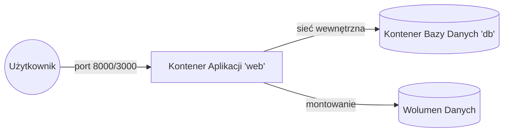

# Laboratorium 4: Konteneryzacja aplikacji Django za pomocą Dockera

## Czas trwania: 6 godzin

### Cel:
Przygotowanie aplikacji do pracy w środowisku izolowanym przy użyciu Dockera. Konfiguracja `Dockerfile` oraz `docker-compose` dla aplikacji Python (Django) lub JavaScript (Node.js).

### Zadania i ćwiczenia:

1. **Przygotowanie środowiska (0.5h):**
   - Stwórz gałąź `feature/dockerization`.
   - Upewnij się, że masz plik zależności: `requirements.txt` dla Pythona lub `package.json` dla Node.js.
   - **Dodaj plik `.dockerignore`**, aby uniknąć kopiowania zbędnych plików (np. `__pycache__`, `node_modules`, `.git`) do obrazu.

2. **Tworzenie Dockerfile (1.5h):**
   - Przygotuj plik `Dockerfile` dla swojej aplikacji:
     - **Python:** Baza `python:3.11-slim`, instalacja `pip install -r requirements.txt`.
     - **Node.js:** Baza `node:20-slim`, instalacja `npm install`.
   - Zbuduj obraz: `docker build -t my-app .`.
   - **Commit:** "Add Dockerfile and .dockerignore".

3. **Orkiestracja z Docker Compose (2.5h):**
   - Stwórz plik `docker-compose.yml` zawierający serwis `web` (Twoja aplikacja) oraz `db` (PostgreSQL lub MongoDB).
   - Skonfiguruj zmienne środowiskowe (Environment Variables) dla połączenia z bazą danych.
   - Uruchom cały stos: `docker-compose up`.
   - **Commit:** "Add docker-compose for app and database orchestration".

4. **Zarządzanie kontenerami i inspekcja (1.5h):**
   - Sprawdź działające kontenery: `docker ps`.
   - Przejrzyj logi aplikacji: `docker-compose logs -f web`.
   - Wejdź do wnętrza kontenera: `docker-compose exec web bash` (lub `sh`).
   - Sprawdź zużycie zasobów: `docker stats`.

---

### Architektura Docker Compose

Poniższy diagram przedstawia sposób komunikacji między serwisami zdefiniowanymi w pliku `docker-compose.yml`.

### Przydatne komendy Docker

| Komenda | Opis |
|---------|------|
| `docker build -t nazwa .` | Buduje obraz na podstawie Dockerfile |
| `docker-compose up -d` | Uruchamia serwisy w tle (detached mode) |
| `docker-compose down` | Zatrzymuje i usuwa kontenery oraz sieci |
| `docker-compose logs -f` | Wyświetla logi w czasie rzeczywistym |
| `docker system prune` | Usuwa nieużywane obrazy, kontenery i sieci |

---

---
**Wskazówka:** Więcej informacji o tworzeniu plików `Dockerfile` oraz instrukcję wdrożenia na Render.com znajdziesz w pliku [docker_guide.md](./docker_guide.md).
---

### Lista kontrolna (Checklist):
- [ ] Czy stworzono i wykorzystano nową gałąź `feature/dockerization`?
- [ ] Czy stworzono plik `.dockerignore`, aby zminimalizować rozmiar obrazu?
- [ ] Czy plik zależności (`requirements.txt` lub `package.json`) zawiera wszystkie niezbędne biblioteki?
- [ ] Czy `Dockerfile` bazuje na oficjalnym obrazie odpowiednim dla technologii (`python:slim`, `node:slim`)?
- [ ] Czy `Dockerfile` poprawnie kopiuje pliki źródłowe i instaluje zależności?
- [ ] Czy w `Dockerfile` zdefiniowano odpowiednią komendę startową (`CMD`)?
- [ ] Czy obraz Dockera buduje się bez błędów (`docker build -t app-test .`)?
- [ ] Czy plik `docker-compose.yml` zawiera co najmniej dwa serwisy: `web` (aplikacja) i `db` (baza danych)?
- [ ] Czy zmienne środowiskowe (host, port, user, password) są poprawnie przekazywane do aplikacji w `docker-compose.yml`?
- [ ] Czy w kodzie aplikacji (np. `settings.py` lub `.env`) baza danych jest skonfigurowana do łączenia się z nazwą serwisu zdefiniowaną w Compose (np. `db`) zamiast `localhost`?
- [ ] Czy wolumeny (volumes) dla bazy danych są poprawnie zdefiniowane (np. w celu zachowania danych)?
- [ ] Czy sprawdzono logi kontenerów za pomocą `docker-compose logs`?
- [ ] Czy potrafisz wejść do powłoki (shell) działającego kontenera?
- [ ] Czy aplikacja uruchamia się poprawnie za pomocą komendy `docker-compose up` i jest dostępna w przeglądarce?
- [ ] Czy wykonano migracje bazy danych wewnątrz kontenera (np. `docker-compose exec web python manage.py migrate`)?
- [ ] Czy sprawozdanie w formacie PDF zostało przygotowane (zawiera zrzuty ekranu z budowania obrazu i działania kontenerów)?

### Wymagania na zaliczenie:
- Pliki `Dockerfile` i `docker-compose.yml` w repozytorium.
- Umiejętność uruchomienia projektu jedną komendą `docker-compose up`.
- Historia zmian na dedykowanej gałęzi.
