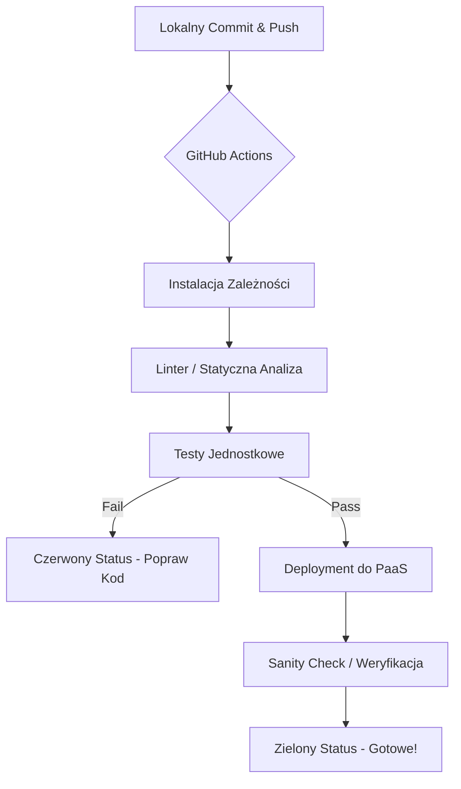

# Laboratorium 5: Automatyzacja CI/CD z GitHub Actions i wdrożenie PaaS

## Czas trwania: 6 godzin

### Cel:
Automatyzacja procesów testowania i wdrażania aplikacji (Python lub JavaScript) przy użyciu GitHub Actions oraz darmowych platform typu PaaS (np. Render.com, Leapcell.io, Vercel, Railway).

### Zadania i ćwiczenia:

1. **Testy jednostkowe (1h):**
   - Napisz minimum 2 testy jednostkowe dla swoich widoków, modeli lub funkcji.
   - **Python:** Uruchom testy: `python manage.py test`.
   - **JavaScript:** Zainstaluj `jest` i uruchom testy: `npm test`.
   - **Commit:** "Add unit tests for the application".

2. **Konfiguracja GitHub Actions CI (2h):**
   - Stwórz plik `.github/workflows/main.yml`.
   - Skonfiguruj potok (pipeline), który po każdym `push` uruchamia: Lintera (flake8 dla Py, ESLint dla JS) oraz testy jednostkowe.
   - **Zadanie:** Celowo zepsuj test i sprawdź, czy GitHub Actions zgłosi błąd (czerwony status). Napraw błąd.
   - **Commit:** "Configure GitHub Actions CI pipeline".

3. **Optymalizacja Workflow - Cache (1h):**
   - Dodaj krok `actions/cache` do swojego workflow, aby przyspieszyć instalację zależności (pip lub npm).
   - Porównaj czas wykonania pipeline'u przed i po dodaniu cache.

4. **Wdrożenie na Render.com lub Leapcell.io (2h):**
   - Połącz swoje repozytorium z wybraną platformą (Render lub Leapcell).
   - Skonfiguruj "Deploy Hook" (Render) lub odpowiedni mechanizm wdrożenia (Leapcell).
   - Dodaj krok w GitHub Actions, który po udanych testach wyśle powiadomienie do platformy (Auto-deploy).
   - **Weryfikacja:** Po wdrożeniu sprawdź, czy endpoint `/` (lub inny) zwraca status 200 OK za pomocą prostej akcji `curl` w pipeline CD.
   - **Commit:** "Integrate CD with PaaS via Deploy Hook and sanity check".

---

### Przepływ CI/CD (Pipeline)

Diagram ilustruje etapy, przez które przechodzi kod od momentu wypchnięcia zmian do repozytorium aż po wdrożenie na serwer.

### Popularne GitHub Actions

| Akcja | Opis |
|-------|------|
| `actions/checkout@v4` | Pobiera kod repozytorium do kontenera akcji |
| `actions/setup-python@v5` | Konfiguruje środowisko Pythona |
| `actions/setup-node@v4` | Konfiguruje środowisko Node.js |
| `actions/cache@v4` | Przechowuje zależności w celu przyspieszenia buildów |
| `rtCamp/action-slack-notify` | Wysyła powiadomienia na Slack o statusie buildu |

---

### Lista kontrolna (Checklist):
- [ ] Czy napisano i pomyślnie uruchomiono lokalnie co najmniej 2 testy jednostkowe?
- [ ] Czy plik workflow (`.github/workflows/main.yml`) został stworzony i znajduje się w poprawnym folderze?
- [ ] Czy workflow zawiera kroki do instalacji zależności, uruchomienia lintera oraz testów?
- [ ] Czy dodano mechanizm **cache** dla zależności (pip/npm)?
- [ ] Czy w historii commitów widać dowód na celowe popsucie testu i jego późniejszą naprawę?
- [ ] Czy potok CI na GitHubie jest "zielony" dla najnowszego commita?
- [ ] Czy testy są automatycznie uruchamiane przy każdym `push` i `pull_request`?
- [ ] Czy aplikacja została połączona z platformą PaaS (np. Render.com, Leapcell.io)?
- [ ] Czy poprawnie skonfigurowano zmienne środowiskowe i Secrets na GitHubie?
- [ ] Czy wdrożenie (deployment) na platformę zewnętrzną zakończyło się sukcesem?
- [ ] Czy w pipeline dodano krok weryfikujący działanie aplikacji po wdrożeniu (np. `curl`)?
- [ ] Czy aplikacja jest dostępna pod publicznym adresem URL i działa poprawnie?
- [ ] Czy sprawozdanie w formacie PDF zostało przygotowane (zawiera link do działającej aplikacji i zrzut ekranu z zielonego potoku CI)?

### Wymagania na zaliczenie:
- Działający i udokumentowany potok CI/CD.
- Aplikacja wdrożona w chmurze (PaaS).
- Poprawnie skonfigurowane Secrets w GitHubie.
