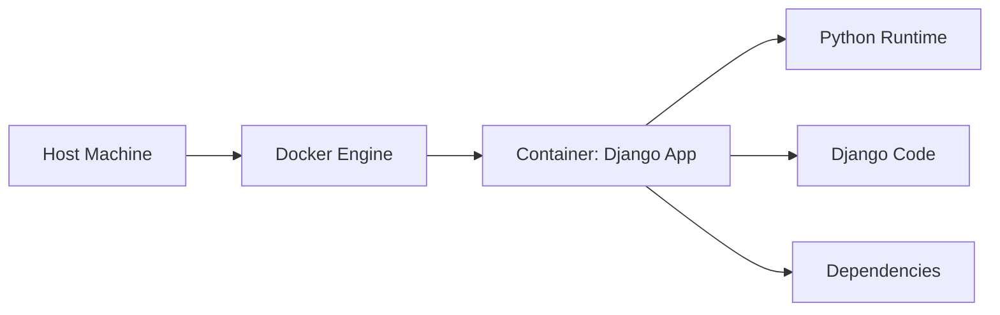

# Laboratorium 7: Konteneryzacja aplikacji Django za pomocą Dockera

## Czas trwania: 6 godzin

### Cel:
Opanowanie narzędzia Docker w zakresie tworzenia obrazów dla aplikacji Django oraz zarządzania kontenerami lokalnie.

### Zadania i ćwiczenia:

**Struktura konteneryzacji:**


1. **Instalacja i podstawy Docker CLI (2h):**
   - Instalacja Docker Desktop (lub Docker Engine na Linux).
   - Uruchamianie testowych kontenerów (`docker run hello-world`).
   - Podstawowe komendy: `docker ps`, `docker images`, `docker stop`, `docker rm`.

2. **Tworzenie Dockerfile dla Django (4h):**
   - Wybór obrazu bazowego: `python:3.11-slim`.
   - Ustawienie zmiennych środowiskowych (`PYTHONDONTWRITEBYTECODE`, `PYTHONUNBUFFERED`).
   - Kopiowanie `requirements.txt` i instalacja zależności.
   - Kopiowanie kodu aplikacji.
   - Definiowanie `CMD ["python", "manage.py", "runserver", "0.0.0.0:8000"]`.

**Przykładowy `Dockerfile` dla aplikacji Django:**
```dockerfile
# Obraz bazowy
FROM python:3.11-slim

# Środowisko
ENV PYTHONDONTWRITEBYTECODE 1
ENV PYTHONUNBUFFERED 1

# Katalog roboczy
WORKDIR /app

# Instalacja zależności systemowych (opcjonalnie)
RUN apt-get update && apt-get install -y build-essential libpq-dev && rm -rf /var/lib/apt/lists/*

# Instalacja zależności Python
COPY requirements.txt /app/
RUN pip install --no-cache-dir -r requirements.txt

# Kopiowanie kodu projektu
COPY . /app/

# Port na którym pracuje kontener
EXPOSE 8000

# Komenda startowa
CMD ["python", "manage.py", "runserver", "0.0.0.0:8000"]
```

3. **Optymalizacja obrazu i .dockerignore (2h):**
   - Stworzenie pliku `.dockerignore` (wykluczenie `venv`, `.git`, `__pycache__`).
   - Analiza warstw obrazu.
   - Zmiana użytkownika wewnątrz kontenera na non-root dla zwiększenia bezpieczeństwa.

**Przykładowy `.dockerignore`:**
```text
venv
.git
__pycache__
*.pyc
db.sqlite3
.env
```

4. **Budowanie i uruchamianie obrazu (2h):**
   - Budowanie: `docker build -t moja-aplikacja-django .`.
   - Uruchamianie z mapowaniem portów: `docker run -p 8000:8000 moja-aplikacja-django`.
   - Przekazywanie zmiennych środowiskowych przez flagę `-e`.

### Lista kontrolna (Checklist):
- [ ] Czy plik `Dockerfile` znajduje się w katalogu głównym projektu?
- [ ] Czy obraz buduje się bez błędów?
- [ ] Czy plik `.dockerignore` poprawnie pomija folder wirtualnego środowiska?
- [ ] Czy aplikacja wewnątrz kontenera jest dostępna pod adresem `localhost:8000`?
- [ ] Czy rozmiar obrazu jest zoptymalizowany (użycie wersji `-slim`)?

### Wymagania na zaliczenie:
- Poprawny plik `Dockerfile`.
- Pomyślne zbudowanie obrazu i uruchomienie kontenera lokalnie.
- Udokumentowanie logów z poprawnego startu aplikacji w kontenerze.
