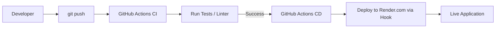

# Laboratorium 9: Automatyzacja CI/CD z GitHub Actions i Render.com

## Czas trwania: 6 godzin

### Cel:
Wdrożenie potoku ciągłej integracji i ciągłego dostarczania (CI/CD) dla aplikacji Django, automatyzującego testy i wdrożenie na platformę Render.com.

### Zadania i ćwiczenia:

**Przepływ CI/CD:**


1. **Przygotowanie testów jednostkowych (2h):**
   - Napisanie prostych testów dla modeli lub widoków Django w `tests.py`.
   - Uruchamianie testów lokalnie: `python manage.py test`.

**Przykładowy test Django (`base/tests.py`):**
```python
from django.test import TestCase
from django.urls import reverse

class BasicTest(TestCase):
    def test_home_page_status_code(self):
        response = self.client.get('/')
        self.assertEqual(response.status_code, 200)

    def test_simple_logic(self):
        self.assertEqual(1 + 1, 2)
```

2. **Konfiguracja GitHub Actions - CI (3h):**
   - Utworzenie pliku `.github/workflows/django_ci.yml`.
   - Konfiguracja etapów: instalacja zależności, uruchomienie lintera (np. `flake8`) oraz testów.
   - Wyzwalanie workflow przy każdym `push` do gałęzi `main`.

**Przykładowy workflow CI (`.github/workflows/django_ci.yml`):**
```yaml
name: Django CI

on:
  push:
    branches: [ "main" ]
  pull_request:
    branches: [ "main" ]

jobs:
  test:
    runs-on: ubuntu-latest
    steps:
    - uses: actions/checkout@v3
    - name: Set up Python
      uses: actions/setup-python@v4
      with:
        python-version: '3.11'
    - name: Install Dependencies
      run: |
        python -m pip install --upgrade pip
        pip install -r requirements.txt
    - name: Run Tests
      run: |
        python manage.py test
```

3. **Automatyzacja wdrożenia - CD (3h):**
   - Wykorzystanie "Deploy Hooks" w Render.com.
   - Dodanie kroku w GitHub Actions, który po pozytywnym przejściu testów wyśle zapytanie do Render (np. za pomocą `curl`), aby zainicjować nowe wdrożenie.
   - Przechowywanie adresu webhooka w "GitHub Secrets".

**Krok CD do dodania w workflow:**
```yaml
  deploy:
    needs: test
    runs-on: ubuntu-latest
    if: github.ref == 'refs/heads/main'
    steps:
      - name: Deploy to Render
        run: curl -f ${{ secrets.RENDER_DEPLOY_HOOK }}
```

4. **Wdrożenie oparte na kontenerach (opcjonalnie) (2h):**
   - Budowanie obrazu Docker w GitHub Actions.
   - Wysłanie obrazu do Docker Hub lub GitHub Container Registry.
   - Konfiguracja Render do pobierania nowej wersji obrazu.

### Lista kontrolna (Checklist):
- [ ] Czy w repozytorium znajduje się folder `.github/workflows/` z plikiem YAML?
- [ ] Czy potok CI przechodzi pomyślnie (zielony znacznik na GitHub)?
- [ ] Czy testy Django są uruchamiane automatycznie przy każdym wypchnięciu kodu?
- [ ] Czy "Deploy Hook" z Render.com został dodany do sekretów repozytorium?
- [ ] Czy zmiana w kodzie jest automatycznie widoczna na serwerze po kilku minutach?

### Wymagania na zaliczenie:
- Poprawnie skonfigurowany i działający workflow w GitHub Actions.
- Udowodnienie automatycznego wdrożenia nowej funkcjonalności na Render.com.
- Wszystkie testy w CI muszą być zielone.
