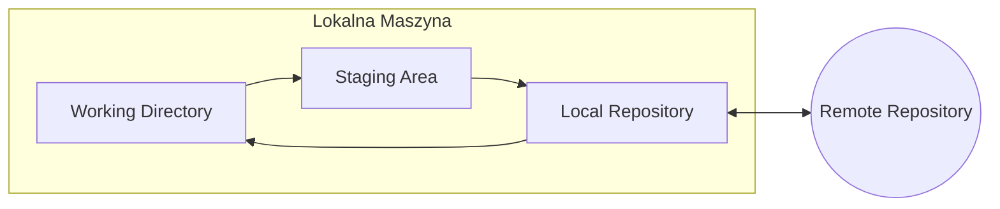

# Wykład 1: Wprowadzenie do integracji systemów i systemu kontroli wersji Git

## Czas trwania: 2 godziny

### Agenda:
1. Definicja i cele integracji systemów informatycznych.
2. Wyzwania w nowoczesnej integracji (rozproszenie, heterogeniczność).
3. Rola systemów kontroli wersji (VCS) w procesie integracji.
4. Architektura i filozofia Git.
5. Podstawowe operacje lokalne: init, add, commit, status, log.
6. Praca z historią i cofanie zmian.

### Treść:

#### 1. Definicja i cele integracji systemów informatycznych
Integracja systemów to proces łączenia różnych podsystemów (komponentów) w jeden spójny system funkcjonalny. Głównym celem jest zapewnienie płynnego przepływu danych i współdziałania aplikacji, które pierwotnie mogły być projektowane jako niezależne jednostki.

**Główne cele integracji:**
* **Spójność danych:** Zapewnienie, że dane w różnych systemach są aktualne i identyczne.
* **Automatyzacja procesów:** Eliminacja ręcznego przepisywania danych między aplikacjami.
* **Poprawa wydajności:** Skrócenie czasu realizacji procesów biznesowych.
* **Lepsza analityka:** Możliwość raportowania na podstawie danych z wielu źródeł.

#### 2. Wyzwania w nowoczesnej integracji
W dobie mikroserwisów i chmury obliczeniowej, integracja staje się coraz bardziej złożona.

| Wyzwanie | Opis |
| :--- | :--- |
| **Rozproszenie** | Usługi działają na różnych serwerach, często w różnych lokalizacjach geograficznych. |
| **Heterogeniczność** | Systemy są pisane w różnych językach, używają różnych baz danych i protokołów. |
| **Skalowalność** | System integracyjny musi radzić sobie ze zmiennym obciążeniem. |
| **Bezpieczeństwo** | Ochrona danych przesyłanych między niezaufanymi sieciami. |

#### 3. Rola systemów kontroli wersji (VCS) w procesie integracji
Systemy kontroli wersji (takie jak Git) są fundamentem CI/CD (Continuous Integration / Continuous Delivery). Pozwalają na:
* Synchronizację pracy wielu programistów.
* Śledzenie historii zmian (kto, co i kiedy zmienił).
* Możliwość powrotu do poprzednich wersji w razie awarii.
* Automatyczne uruchamianie testów przy każdej próbie integracji nowego kodu.

#### 4. Architektura i filozofia Git
Git jest **rozproszonym** systemem kontroli wersji. Oznacza to, że każdy programista posiada pełną kopię repozytorium na swoim dysku.



*   **Working Directory:** Miejsce, gdzie edytujesz pliki.
*   **Staging Area (Index):** Poczekalnia dla zmian, które mają trafić do następnego commitu.
*   **Local Repository:** Lokalna baza danych z historią zmian (.git).

#### 5. Podstawowe operacje lokalne
Praca z Gitem zaczyna się od inicjalizacji lub sklonowania projektu.

*   `git init` – tworzy nowe repozytorium w bieżącym folderze.
*   `git status` – sprawdza stan plików (czy są śledzone, zmodyfikowane).
*   `git add <plik>` – dodaje zmiany do Staging Area.
*   `git commit -m "opis"` – zapisuje zmiany w lokalnym repozytorium.
*   `git log` – wyświetla historię zmian.

**Przykład sekwencji komend:**
```bash
git init
echo "# Projekt Integracja" > README.md
git add README.md
git commit -m "Initial commit"
git status
```

#### 6. Praca z historią i cofanie zmian
Git pozwala na bezpieczne eksperymentowanie.

*   `git checkout -- <plik>` – wycofuje zmiany w pliku (do stanu z ostatniego commitu).
*   `git reset HEAD <plik>` – usuwa plik ze Staging Area (ale zachowuje zmiany na dysku).
*   `git commit --amend` – poprawia ostatni commit.
*   `git revert <commit_hash>` – tworzy nowy commit odwracający zmiany ze wskazanego punktu.
