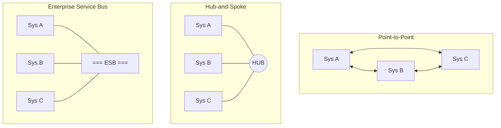
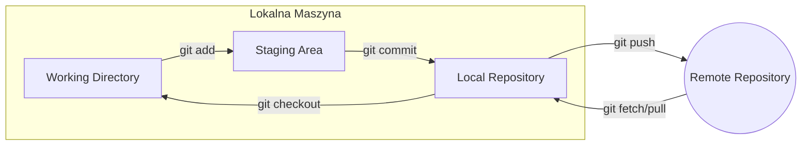

# Wykład 1: Wprowadzenie do integracji i system kontroli wersji Git (z elementami Markdown)

## Czas trwania: 2 godziny

### Agenda:
1. Definicja i cele integracji systemów informatycznych.
2. Poziomy integracji (dane, aplikacje, procesy, interfejsy).
3. Klasyfikacja architektur integracyjnych (Point-to-Point, Hub-and-Spoke, Bus).
4. Wyzwania w nowoczesnej integracji (rozproszenie, heterogeniczność, skalowalność).
5. Rola systemów kontroli wersji (VCS) w procesie integracji.
6. Markdown – standard dokumentacji technicznej.
7. Architektura i filozofia Git: obiekty (blob, tree, commit) i stany pliku.
8. Podstawowe operacje lokalne: init, add, commit, status, log, diff.
9. Praca z historią i bezpieczne cofanie zmian.

### Treść:

#### 1. Definicja i cele integracji systemów informatycznych
Integracja systemów to proces łączenia różnych podsystemów (komponentów) w jeden spójny system funkcjonalny. Głównym celem jest zapewnienie płynnego przepływu danych i współdziałania aplikacji, które pierwotnie mogły być projektowane jako niezależne jednostki.

**Główne cele integracji:**
*   **Spójność danych:** Zapewnienie, że dane w różnych systemach są aktualne i identyczne.
*   **Automatyzacja procesów:** Eliminacja ręcznego przepisywania danych między aplikacjami.
*   **Poprawa wydajności:** Skrócenie czasu realizacji procesów biznesowych.
*   **Lepsza analityka:** Możliwość raportowania na podstawie danych z wielu źródeł (tzw. "Single Source of Truth").

#### 2. Poziomy integracji
Integracja może zachodzić na różnych warstwach systemu:
1.  **Integracja na poziomie danych (Data Level):** Bezpośrednia wymiana danych między bazami danych (np. ETL - Extract, Transform, Load). Najstarsza i najprostsza metoda, ale wiąże systemy silnie ze strukturą bazy.
2.  **Integracja na poziomie aplikacji/logiki (Application/API Level):** Systemy komunikują się za pomocą interfejsów programistycznych (API, np. REST, SOAP). Pozwala na zachowanie niezależności wewnętrznej logiki systemów.
3.  **Integracja na poziomie procesów biznesowych (Process Level):** Koordynacja przepływu pracy między wieloma systemami w celu realizacji złożonego procesu biznesowego (np. BPM - Business Process Management).
4.  **Integracja na poziomie interfejsu użytkownika (UI Level):** Agregacja danych z różnych systemów w jednym interfejsie (np. portale, dashboardy, mikrofrontendy).

#### 3. Klasyfikacja architektur integracyjnych

*   **Point-to-Point (Punkt-Punkt):** Bezpośrednie połączenie między każdą parą systemów.
    *   *Zaleta:* Proste przy 2-3 systemach.
    *   *Wada:* "Spaghetti integracyjne" przy większej skali ($N*(N-1)/2$ połączeń).
*   **Hub-and-Spoke:** Centralny węzeł (Hub), który przekierowuje dane między systemami (Spoke).
    *   *Zaleta:* Mniejsza liczba połączeń ($N$ połączeń).
    *   *Wada:* Hub staje się "Single Point of Failure" i wąskim gardłem.
*   **Enterprise Service Bus (ESB):** Magistrala usługowa, przez którą przepływają komunikaty. Wspiera transformację formatów i routing.
    *   *Zaleta:* Wysoka elastyczność i skalowalność. Standard w dużych przedsiębiorstwach.



#### 4. Wyzwania w nowoczesnej integracji
W dobie mikroserwisów i chmury obliczeniowej, integracja staje się coraz bardziej złożona.

| Wyzwanie | Opis |
| :--- | :--- |
| **Rozproszenie** | Usługi działają na różnych serwerach, często w różnych lokalizacjach geograficznych. |
| **Heterogeniczność** | Systemy są pisane w różnych językach, używają różnych baz danych i protokołów. |
| **Skalowalność** | System integracyjny musi radzić sobie ze zmiennym obciążeniem. |
| **Bezpieczeństwo** | Ochrona danych przesyłanych między niezaufanymi sieciami. |

#### 5. Rola systemów kontroli wersji (VCS) w procesie integracji
Systemy kontroli wersji (takie jak Git) są fundamentem **Continuous Integration (CI)**. Pozwalają na:
*   **Synchronizację pracy:** Wiele osób może pracować na tym samym kodzie bez nadpisywania swoich zmian.
*   **Identyfikowalność:** Każda zmiana ma autora i opis (Commit Message), co ułatwia debugowanie integracji.
*   **Izolację zmian:** Praca na gałęziach (branches) pozwala na testowanie nowej funkcjonalności przed dołączeniem jej do głównego systemu.
*   **Automatyzację:** Zmiana w VCS może wyzwolić procesy budowania i testowania (np. GitHub Actions).

#### 6. Markdown – standard dokumentacji technicznej
Markdown to lekki język znaczników, służący do formatowania tekstu. Jest standardem w dokumentacji projektów IT (np. pliki `README.md` na GitHub).

**Podstawowa składnia:**
*   `# Nagłówek 1`, `## Nagłówek 2` – nagłówki.
*   `**Pogrubienie**`, `*Kursywa*` – formatowanie tekstu.
*   `[Link](https://url.com)` – odnośniki.
*   `` – obrazy.
*   `- Element listy` – listy wypunktowane.
*   `1. Element listy` – listy numerowane.
*   `` `kod inline` `` – kod wewnątrz linii.
*   ` ```bash ` – bloki kodu.

**Dlaczego Markdown?**
- Czytelny dla człowieka i maszyny.
- Łatwa konwersja do HTML/PDF.
- Wspierany przez niemal wszystkie platformy (GitHub, GitLab, Jira, StackOverflow).

#### 7. Architektura i filozofia Git
Git to **rozproszony** system kontroli wersji (DVCS). Każdy węzeł ma pełną historię projektu.

**Kluczowe pojęcia (Obiekty Gita):**
*   **Blob (Binary Large Object):** Zawartość pliku (bez nazwy i uprawnień).
*   **Tree (Drzewo):** Odpowiednik katalogu, mapuje nazwy na bloby lub inne drzewa.
*   **Commit:** "Migawka" (snapshot) całego projektu w danym czasie, zawiera metadane (autor, data, wiadomość) oraz wskaźnik do korzenia drzewa.

**Trzy stany pliku w Git:**
1.  **Modified (Zmodyfikowany):** Zmieniłeś plik, ale nie zapisałeś zmiany w bazie Git.
2.  **Staged (Oczekujący):** Oznaczyłeś zmodyfikowany plik w jego aktualnej wersji, aby znalazł się w następnym commicie.
3.  **Committed (Zatwierdzony):** Dane są bezpiecznie zapisane w Twojej lokalnej bazie danych.



#### 8. Podstawowe operacje lokalne
Praca z Gitem zaczyna się od inicjalizacji lub sklonowania projektu.

*   `git init` – tworzy nowe repozytorium w bieżącym folderze.
*   `git status` – sprawdza stan plików (czy są śledzone, zmodyfikowane).
*   `git add <plik>` – dodaje zmiany do Staging Area.
*   `git commit -m "opis"` – zapisuje zmiany w lokalnym repozytorium.
*   `git log` – wyświetla historię zmian.
*   `git diff` – pokazuje różnice między plikami.
*   `git blame <plik>` – pokazuje, kto zmienił każdą linię w pliku.

**Przykład sekwencji komend:**
```bash
git init
echo "# Projekt Integracja" > README.md
git add README.md
git commit -m "Initial commit"
git status
```

#### 9. Praca z historią i cofanie zmian
Git pozwala na bezpieczne eksperymentowanie.

*   `git checkout -- <plik>` – wycofuje zmiany w pliku (do stanu z ostatniego commitu). **Uwaga:** Ta komenda nadpisuje zmiany na dysku!
*   `git reset HEAD <plik>` – usuwa plik ze Staging Area (ale zachowuje zmiany na dysku).
*   `git commit --amend` – poprawia ostatni commit (np. gdy zapomniałeś dodać pliku lub zrobiłeś literówkę w opisie).
*   `git revert <commit_hash>` – tworzy nowy commit odwracający zmiany ze wskazanego punktu (najbezpieczniejsza metoda cofania w historii publicznej).
