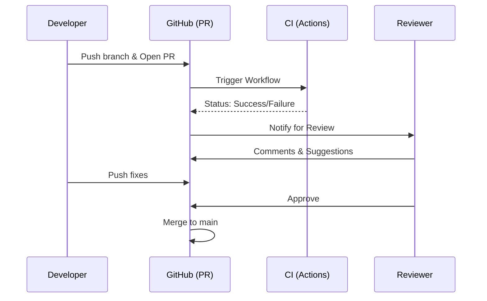
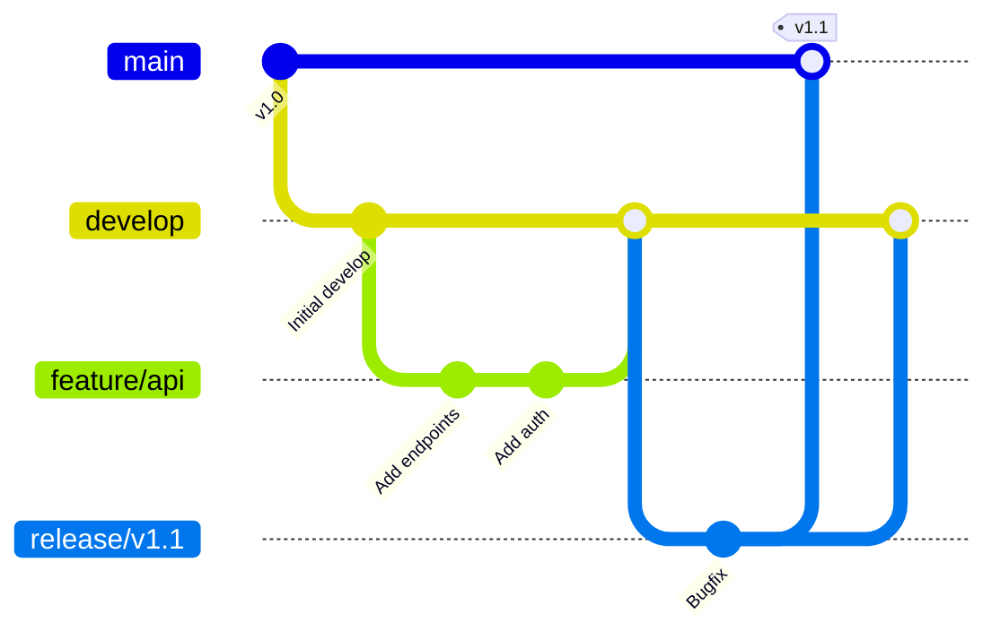
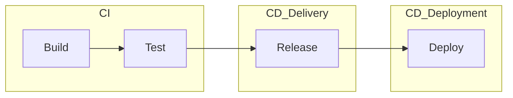

# Wykład 2: Zaawansowany Git, praca zespołowa i workflow na GitHub

## Czas trwania: 2 godziny

### Agenda:
1. Współpraca zdalna: protokoły (SSH vs HTTPS), zarządzanie `remotes`.
2. Cykl życia Pull Requesta i kultura Code Review.
3. Strategie pracy zespołowej (Workflow): Git Flow, GitHub Flow, Trunk Based Development.
4. Zaawansowane operacje: stashing, cherry-picking, rebase.
5. Rozwiązywanie konfliktów: techniki i narzędzia.
6. Wprowadzenie do CI/CD (Continuous Integration, Delivery, Deployment).
7. GitHub Actions: automatyzacja testów i weryfikacji.

### Treść:

#### 1. Współpraca zdalna
Git pozwala na synchronizację lokalnego repozytorium z serwerami zewnętrznymi (tzw. `remotes`).

*   **Protokoły komunikacji:**
    *   **HTTPS:** Łatwiejszy w konfiguracji, wymaga podania tokenu (Personal Access Token) przy autoryzacji.
    *   **SSH:** Bezpieczniejszy, wykorzystuje parę kluczy (publiczny i prywatny). Nie wymaga wpisywania hasła przy każdej operacji po skonfigurowaniu klucza.
*   **Komendy:**
    *   `git remote add origin <url>` – podpięcie zdalnego serwera.
    *   `git push` – wysłanie zmian na serwer.
    *   `git fetch` – pobranie informacji o zmianach ze zdalnego repozytorium (bez ich scalania).
    *   `git pull` – pobranie i automatyczne scalenie zmian (fetch + merge).

#### 2. Pull Requests i Code Review
Pull Request (PR) to nie tylko prośba o scalenie kodu, to proces zapewnienia jakości i integracji wiedzy.

**Cykl życia PR:**
1.  **Creation:** Programista wypycha gałąź `feature` i otwiera PR.
2.  **Verification:** Automatyczne testy (CI) sprawdzają, czy kod się buduje i przechodzi testy.
3.  **Review:** Inni członkowie zespołu komentują kod, sugerują poprawki.
4.  **Iteration:** Autor nanosi poprawki na tę samą gałąź (PR aktualizuje się automatycznie).
5.  **Approval:** Po uzyskaniu wymaganej liczby zatwierdzeń, kod jest gotowy.
6.  **Merge:** Scalenie zmian do głównej gałęzi (np. `main`).



**Dobre praktyki Code Review:**
*   Bądź konstruktywny (skup się na kodzie, nie na osobie).
*   Sprawdzaj nie tylko błędy, ale i czytelność oraz architekturę.
*   Zadawaj pytania ("Dlaczego wybrałeś to rozwiązanie?").
*   Wykorzystuj narzędzia typu Linter/Formatter do automatyzacji stylu.

#### 3. Strategie pracy zespołowej (Workflow)
Wybór strategii zależy od rozmiaru zespołu i częstotliwości wydań.

*   **GitHub Flow:**
    *   Wszystko w `main` musi być zawsze gotowe do wdrożenia.
    *   Każda nowa funkcja/poprawka na osobnej gałęzi o jasnej nazwie.
    *   Merge do `main` następuje natychmiast po zatwierdzeniu PR.
*   **Git Flow:** (Ilustracja poniżej)
    *   `main` - kod produkcyjny.
    *   `develop` - główna gałąź integracyjna dla programistów.
    *   `feature/` - nowe funkcjonalności (odchodzą od `develop`).
    *   `release/` - przygotowanie do wydania nowej wersji.
    *   `hotfix/` - pilne poprawki błędów produkcyjnych (bezpośrednio do `main` i `develop`).



#### 4. Zaawansowane operacje i rozwiązywanie konfliktów
Konflikt występuje, gdy dwie osoby zmieniły tę samą linię w tym samym pliku.

*   **Merge (Scalanie):** Łączy historie obu gałęzi, tworząc nowy "merge commit". Zachowuje pełny kontekst historyczny.
*   **Rebase (Przebudowanie):** Przenosi Twoje zmiany na koniec zmian z innej gałęzi. Tworzy liniową historię, ale zmienia identyfikatory commitów.

**Jak rozwiązać konflikt?**
1. Otwórz plik z konfliktem.
2. Znajdź sekcje oznaczone przez `<<<<<<< HEAD` i `>>>>>>> branch-name`.
3. Wybierz docelową wersję kodu i usuń znaczniki Gita.
4. `git add <plik>` i `git commit`.


#### 6. Zarządzanie uprawnieniami
Bezpieczeństwo repozytorium jest kluczowe w integracji:
*   **Branch Protection Rules:** Blokowanie bezpośredniego pusha do `main`, wymóg statusu "pass" z testów CI przed mergem.
*   **Rola użytkowników:** Read, Triage, Write, Maintain, Admin.
*   **Secrets:** Bezpieczne przechowywanie haseł i kluczy API wykorzystywanych przez GitHub Actions.

#### 6. Wprowadzenie do CI/CD
**Continuous Integration (CI)** to praktyka częstego scalania kodu wszystkich programistów do wspólnego repozytorium (często wiele razy dziennie).

**Kluczowe elementy CI/CD:**
1.  **Continuous Integration (CI):** Automatyczne budowanie i testowanie przy każdym pushu. Celem jest szybkie wykrycie błędów.
2.  **Continuous Delivery (CD):** Kod jest zawsze gotowy do wdrożenia na produkcję, ale samo wdrożenie wymaga decyzji człowieka (manualne kliknięcie).
3.  **Continuous Deployment (CD):** Każda zmiana, która przejdzie testy, jest automatycznie wdrażana na produkcję.



#### 7. GitHub Actions – Automatyzacja
GitHub Actions to platforma do automatyzacji cyklu życia oprogramowania (Workflow). Pozwala na budowanie, testowanie i wdrażanie kodu bezpośrednio z poziomu GitHuba.

**Podstawowe pojęcia:**
*   **Workflow:** Zautomatyzowany proces (zapisany w pliku `.yml`), który składa się z jednego lub więcej zadań.
*   **Events:** Zdarzenia wyzwalające workflow (np. `push`, `pull_request`, `schedule`).
*   **Jobs:** Grupa kroków wykonywanych na tym samym runnerze. Zadania mogą działać równolegle lub zależnie od siebie.
*   **Steps:** Pojedyncze zadania wewnątrz Job (np. wykonanie komendy powłoki lub użycie zewnętrznej akcji).
*   **Actions:** Samodzielne, reużywalne jednostki kodu (np. `actions/checkout@v4`).
*   **Runner:** Serwer, na którym wykonywane są zadania (hostowany przez GitHub lub własny).

**Dobre praktyki workflow:**
1.  Uruchamiaj CI zarówno na `push`, jak i na `pull_request` (zapewnia testy dla forków i przed mergem).
2.  Buforuj zależności (cache) dla szybszych buildów (`actions/cache`).
3.  Oddzielaj lint/test/build/deploy w osobnych `jobs` lub `steps` z jasnymi nazwami.
4.  Używaj `concurrency` żeby uniknąć wyścigów podczas wielokrotnych pushy do tego samego PR.
5.  Przechowuj sekrety w `Settings -> Secrets and variables` i wstrzykuj je przez `secrets.MY_SECRET`.

**Przykład linta + testów z cache dla Pythona:**
```yaml
name: CI
on: [push, pull_request]

jobs:
  lint_and_test:
    runs-on: ubuntu-latest
    steps:
      - uses: actions/checkout@v4
      - uses: actions/setup-python@v5
        with:
          python-version: '3.11'
      - name: Cache pip
        uses: actions/cache@v4
        with:
          path: ~/.cache/pip
          key: ${{ runner.os }}-pip-${{ hashFiles('**/requirements*.txt') }}
          restore-keys: |
            ${{ runner.os }}-pip-
      - name: Install deps
        run: |
          python -m pip install --upgrade pip
          pip install -r requirements.txt
          pip install flake8
      - name: Lint
        run: flake8 .
      - name: Test
        run: python manage.py test
```

#### 8. Praktyczny przykład: Testowanie projektu Django
Pliki workflow muszą znajdować się w katalogu `.github/workflows/` w głównym folderze repozytorium.

**Przykład pliku `ci.yml`:**
```yaml
name: Django CI

on:
  push:
    branches: [ "main" ]
  pull_request:
    branches: [ "main" ]

jobs:
  build:
    runs-on: ubuntu-latest

    steps:
    - name: Checkout code
      uses: actions/checkout@v4

    - name: Set up Python
      uses: actions/setup-python@v5
      with:
        python-version: '3.10'

    - name: Install dependencies
      run: |
        python -m pip install --upgrade pip
        pip install -r requirements.txt

    - name: Run Tests
      run: |
        python manage.py test
```

**Dlaczego warto używać GitHub Actions w integracji?**
1. **Szybki feedback:** Programista natychmiast dowiaduje się, czy jego zmiany psują projekt.
2. **Standaryzacja:** Każdy kod przechodzi przez te same testy na czystym środowisku.
3. **Automatyzacja powtarzalnych czynności:** Generowanie dokumentacji, budowanie obrazów Docker, wdrażanie na serwer testowy.
