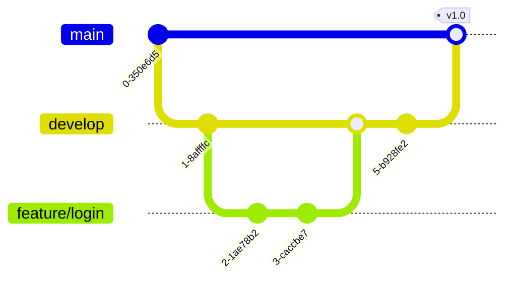

# Wykład 2: Zaawansowany Git, praca zespołowa i workflow na GitHub

## Czas trwania: 2 godziny

### Agenda:
1. Współpraca zdalna: protokoły (SSH vs HTTPS), remotes.
2. Zaawansowane operacje na gałęziach: stashing, cherry-picking.
3. Strategie pracy zespołowej: Git Flow vs GitHub Flow vs Trunk Based Development.
4. Rozwiązywanie konfliktów podczas scalania (merge vs rebase).
5. GitHub jako centrum integracji: Issues, Projects, Milestones.
6. Pull Requests i Code Review – kultura jakości kodu i integracji.
7. Branch Protection i GitHub Actions jako bramka jakości.

### Treść:

#### 1. Współpraca zdalna
Git pozwala na synchronizację lokalnego repozytorium z serwerami zewnętrznymi (tzw. `remotes`).

*   **Protokoły komunikacji:**
    *   **HTTPS:** Łatwiejszy w konfiguracji, wymaga podania tokenu (Personal Access Token) przy autoryzacji.
    *   **SSH:** Bezpieczniejszy, wykorzystuje parę kluczy (publiczny i prywatny). Nie wymaga wpisywania hasła przy każdej operacji po skonfigurowaniu klucza.
*   **Komendy:**
    *   `git remote add origin <url>` – podpięcie zdalnego serwera.
    *   `git push` – wysłanie zmian na serwer.
    *   `git fetch` – pobranie informacji o zmianach ze zdalnego repozytorium (bez ich scalania).
    *   `git pull` – pobranie i automatyczne scalenie zmian (fetch + merge).

#### 2. Gałęzie (branches) i zaawansowane operacje
Gałęzie pozwalają na równoległe rozwijanie różnych funkcji bez wpływania na stabilną wersję kodu.

*   `git stash` – tymczasowe "odłożenie" zmian na bok, aby móc zmienić gałąź bez robienia commitu.
*   `git cherry-pick <commit_hash>` – wybranie konkretnego commitu z innej gałęzi i zaaplikowanie go do obecnej.

**Popularne strategie pracy zespołowej:**
*   **GitHub Flow:** Prosta strategia oparta na krótkotrwałych gałęziach `feature` scalanych bezpośrednio do `main`. Idealna dla systemów z częstym wdrażaniem (Continuous Deployment).
*   **Git Flow:** Bardziej rozbudowana struktura z podziałem na `main`, `develop`, `feature`, `release` i `hotfix`. Dobra dla projektów z cyklicznym wydawaniem wersji.
*   **Trunk Based Development:** Minimalizacja liczby gałęzi, częste commity do `main`.

#### 3. Rozwiązywanie konfliktów
Konflikt występuje, gdy dwie osoby zmieniły tę samą linię w tym samym pliku.

*   **Merge (Scalanie):** Łączy historie obu gałęzi, tworząc nowy "merge commit". Zachowuje pełny kontekst historyczny.
*   **Rebase (Przebudowanie):** Przenosi Twoje zmiany na koniec zmian z innej gałęzi. Tworzy liniową historię, ale zmienia identyfikatory commitów.

**Jak rozwiązać konflikt?**
1. Otwórz plik z konfliktem.
2. Znajdź sekcje oznaczone przez `<<<<<<< HEAD` i `>>>>>>> branch-name`.
3. Wybierz docelową wersję kodu i usuń znaczniki Gita.
4. `git add <plik>` i `git commit`.

#### 4. GitHub jako platforma integracyjna
GitHub oferuje ekosystem narzędzi wykraczający poza samo przechowywanie kodu:
*   **Issues:** Śledzenie błędów i zadań.
*   **Actions:** Automatyzacja (CI/CD) – testowanie i wdrażanie kodu.
*   **Wiki/Pages:** Dokumentacja projektu.
*   **Security Tab:** Skanowanie kodu pod kątem podatności i wycieków sekretów.

#### 5. Pull Requests i Code Review
Pull Request (PR) to prośba o dołączenie zmian z jednej gałęzi do drugiej. Jest to kluczowy moment kontroli jakości.

**Zalety Code Review:**
*   Wykrywanie błędów przed wdrożeniem.
*   Dzielenie się wiedzą w zespole.
*   Utrzymanie spójnego stylu kodu (Linting).
*   Zapewnienie, że kod realizuje postawione wymagania.

#### 6. Zarządzanie uprawnieniami
Bezpieczeństwo repozytorium jest kluczowe w integracji:
*   **Branch Protection Rules:** Blokowanie bezpośredniego pusha do `main`, wymóg statusu "pass" z testów CI przed mergem.
*   **Rola użytkowników:** Read, Triage, Write, Maintain, Admin.
*   **Secrets:** Bezpieczne przechowywanie haseł i kluczy API wykorzystywanych przez GitHub Actions.
