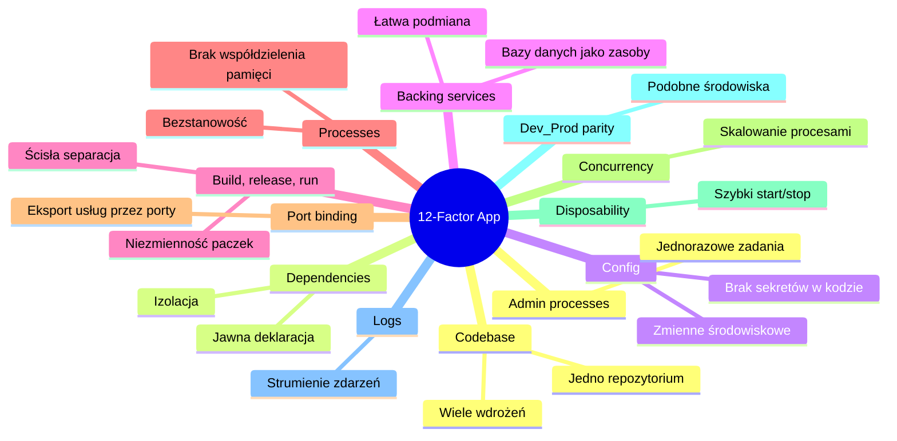

# Wykład 3: Architektura systemów i wprowadzenie do Platform as a Service (PaaS)

## Czas trwania: 2 godziny

### Agenda:
1. Ewolucja hostingu: On-premise -> IaaS -> PaaS -> SaaS -> Serverless.
2. Charakterystyka PaaS: zalety, wady i przypadki użycia (Render, Heroku).
3. Współdzielona odpowiedzialność w chmurze (Shared Responsibility Model).
4. Architektura 12-factor app: szczegółowe omówienie zasad.
5. Separacja kodu od konfiguracji (Environment Variables) i sekrety.
6. Bezstanowość (statelessness) i bazy danych jako Backing Services.
7. Cloud-Native Integration: podejście nowoczesne do łączenia usług.

### Treść:

#### 1. Ewolucja hostingu i modeli chmurowych
Przejście od własnych serwerowni do modeli chmurowych zmieniło sposób integracji systemów.

| Model | Za co odpowiada dostawca | Za co odpowiada klient | Przykład |
| :--- | :--- | :--- | :--- |
| **On-premise** | Nic | Wszystko (sprzęt, OS, dane, aplikacja) | Własny serwer |
| **IaaS** | Sprzęt, wirtualizacja | System operacyjny, dane, aplikacja | AWS EC2 |
| **PaaS** | Sprzęt, OS, Runtime | Dane, aplikacja | Heroku, Azure App Service |
| **SaaS** | Wszystko | Użytkowanie | Gmail, Salesforce |
| **Serverless** | Infrastruktura i skalowanie | Tylko funkcja (kod) | AWS Lambda |

#### 2. Charakterystyka PaaS
Platform as a Service (PaaS) to model, w którym dostawca chmury dostarcza platformę umożliwiającą klientom tworzenie, uruchamianie i zarządzanie aplikacjami bez konieczności budowania i utrzymywania infrastruktury.

*   **Zalety:** Szybkość wdrożenia, automatyczne skalowanie, niższe koszty operacyjne.
*   **Wady:** Uzależnienie od dostawcy (Vendor lock-in), ograniczenia w konfiguracji systemu operacyjnego.

#### 3. Model odpowiedzialności w chmurze
W chmurze bezpieczeństwo i zarządzanie są współdzielone.
*   **Dostawca:** Odpowiada za bezpieczeństwo „chmury” (fizyczne serwery, sieć, wirtualizacja).
*   **Klient:** Odpowiada za bezpieczeństwo „w chmurze” (kod aplikacji, dane, zarządzanie dostępem, konfiguracja).

#### 4. Architektura 12-factor app
Zbiór 12 zasad (stworzony przez inżynierów Heroku) przy tworzeniu aplikacji typu SaaS i natywnych dla chmury. Pozwalają one na budowanie systemów łatwych do skalerowania i integracji.



**Szczegółowe omówienie kluczowych zasad dla integracji:**
*   **III. Config:** Konfiguracja (połączenia z DB, klucze API innych systemów) zmienia się między środowiskami. Przechowywanie jej w zmiennych środowiskowych pozwala na ten sam kod (binarkę/obraz) na każdym etapie.
*   **IV. Backing Services:** Traktuj lokalną bazę (np. SQLite) tak samo jak zdalną usługę (np. Amazon RDS). Aplikacja powinna łączyć się z nimi przez URL/DSN konfigurowany w zmiennych.
*   **VI. Processes:** Aplikacja nie może polegać na lokalnym systemie plików do przechowywania stanu (np. przesłane zdjęcia). Musi użyć zewnętrznej usługi (np. AWS S3) – to klucz do horyzontalnego skalowania integracji.

#### 5. Separacja kodu od konfiguracji i zarządzanie sekretami
Zgodnie z zasadą 3 (Config) aplikacji 12-factor, konfiguracja, która zmienia się między środowiskami (staging, production), nie powinna znajdować się w kodzie.

**Złe podejście:**
```javascript
if (env === 'prod') {
  connect('db.prod.com');
} else {
  connect('localhost');
}
```

**Dobre podejście:**
```javascript
const dbUrl = process.env.DATABASE_URL;
connect(dbUrl);
```

#### 6. Bezstanowość (statelessness)
Aplikacja powinna być bezstanowa. Wszelkie dane, które muszą być trwałe, powinny być przechowywane w zewnętrznej bazie danych lub systemie plików.

**Dlaczego to ważne?**
*   **Skalowanie poziome:** Możemy uruchomić 10 instancji aplikacji, a balancer skieruje ruch do dowolnej z nich.
*   **Odporność na awarie:** Jeśli jedna instancja padnie, inna może przejąć jej zadania, bo nie przechowuje lokalnie danych sesji.
