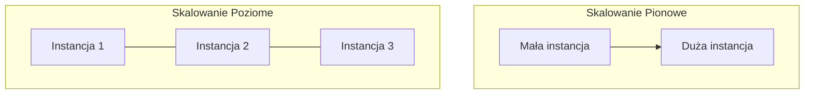

# Wykład 4: Ekosystem PaaS – przegląd rozwiązań i dostawców

## Czas trwania: 2 godziny

### Agenda:
1. Przegląd rynku: Heroku, Render, Vercel, AWS Elastic Beanstalk, Google App Engine, Azure App Service.
2. Usługi dodane (Add-ons): Bazy danych, kolejki, systemy logowania.
3. Zarządzanie zmiennymi środowiskowymi (Environment Variables).
4. Skalowanie poziome i pionowe w ramach PaaS.
5. Koszty i limity (Free tier vs Enterprise).
6. Demo: Cykl życia aplikacji na platformie PaaS.

### Treść:

#### 1. Przegląd rynku PaaS
Wybór platformy zależy od technologii, budżetu i wymagań dotyczących infrastruktury.

| Dostawca | Cechy charakterystyczne | Zastosowanie | Plan darmowy |
| :--- | :--- | :--- | :--- |
| **Heroku** | Pionier PaaS, bardzo prosty w użyciu, świetne CLI. | MVP, małe i średnie aplikacje. | Brak (płatne od 2022). |
| **Render** | Nowoczesna alternatywa dla Heroku, wsparcie Docker. | Nowoczesne web appy, statyczne strony. | Tak (z uśpieniem instancji). |
| **Vercel** | Skupiony na Frontendzie i Next.js, świetne UX. | Aplikacje frontendowe, SSR, Jamstack. | Tak (dla projektów hobbystycznych). |
| **AWS Elastic Beanstalk** | Automatyzuje wdrażanie w ekosystemie AWS. | Skomplikowane systemy, integracja z AWS. | Tak (w ramach AWS Free Tier). |
| **Azure App Service** | Silna integracja z .NET i Active Directory. | Rozwiązania korporacyjne (Enterprise). | Tak (poziom F1 Free). |
| **Google App Engine** | Skaluje się od zera, wsparcie Python/Go/Java. | Aplikacje o zmiennym natężeniu ruchu. | Tak (dzienne limity bezpłatne). |

#### 2. Usługi dodane (Add-ons / Managed Services)
Platformy PaaS oferują "gotowe do użycia" usługi, które integrują się z naszą aplikacją.

*   **Bazy danych:** Managed PostgreSQL, Redis, MongoDB.
*   **Kolejki:** RabbitMQ, Kafka jako usługa.
*   **Logowanie i monitoring:** LogDNA, New Relic, Papertrail.
*   **Zaleta:** Nie musimy instalować ani aktualizować tych usług – robi to dostawca.

#### 3. Zarządzanie zmiennymi środowiskowymi
Zmienne środowiskowe to bezpieczny sposób przekazywania konfiguracji (hasła, klucze API) do aplikacji bez umieszczania ich w kodzie źródłowym.

```bash
# Przykład ustawienia zmiennej w CLI (Heroku)
heroku config:set API_KEY=abc12345
```

**Dlaczego zmienne środowiskowe?**
*   **Bezpieczeństwo:** Klucze nie trafiają do repozytorium Git.
*   **Elastyczność:** Ta sama aplikacja może łączyć się z bazą testową lub produkcyjną zależnie od ustawień środowiska.

#### 4. Skalowanie w ramach PaaS
Wyróżniamy dwa główne podejścia do zwiększania wydajności systemu:

*   **Skalowanie pionowe (Vertical Scaling):** Zwiększenie zasobów (CPU, RAM) pojedynczej instancji.
*   **Skalowanie poziome (Horizontal Scaling):** Zwiększenie liczby działających instancji (kopii) aplikacji.



#### 5. Koszty i limity
Większość dostawców oferuje model **Pay-as-you-go** (płacisz za to, co zużyjesz).

*   **Free Tier:** Idealny do nauki i projektów studenckich, ale ma ograniczenia (np. usypianie aplikacji po braku ruchu, limity godzin).
*   **Hobby/Pro:** Stałe opłaty za instancje, brak usypiania, lepsza wydajność.
*   **Enterprise:** Gwarancje SLA, dedykowane wsparcie, prywatne sieci.

#### 6. Cykl życia aplikacji na PaaS
Typowy proces od kodu do działającej aplikacji:

1.  **Kodowanie:** Pisanie kodu lokalnie.
2.  **Push:** Wysłanie kodu do repozytorium (Git).
3.  **Build:** Platforma wykrywa język i buduje artefakt (np. obraz Docker lub paczkę .jar).
4.  **Deploy:** Uruchomienie nowej wersji na serwerze.
5.  **Health Check:** Sprawdzenie, czy nowa wersja działa poprawnie.
6.  **Switch:** Przełączenie ruchu na nową wersję (Zero-downtime deployment).
