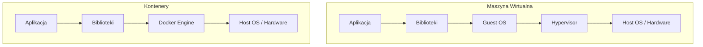

# Wykład 5: Konteneryzacja – wprowadzenie do Docker

## Czas trwania: 2 godziny

### Agenda:
1. Problem "u mnie działa" – geneza konteneryzacji.
2. Wirtualizacja maszynowa (VM) vs Konteneryzacja.
3. Architektura Docker (Daemon, Client, Registry).
4. Kluczowe pojęcia: Obraz (Image) a Kontener (Container).
5. Docker Hub – publiczne i prywatne repozytoria obrazów.
6. Instalacja i konfiguracja środowiska Docker.

### Treść:

#### 1. Problem "u mnie działa"
Głównym powodem powstania konteneryzacji były różnice między środowiskami deweloperskimi a produkcyjnymi (różne wersje bibliotek, inne ustawienia systemu operacyjnego). Docker rozwiązuje ten problem, pakując aplikację wraz ze wszystkimi jej zależnościami do jednego, przenośnego obrazu.

#### 2. Wirtualizacja vs Konteneryzacja
Choć oba rozwiązania służą izolacji, robią to na innych poziomach.

| Cecha | Maszyna Wirtualna (VM) | Kontener (Docker) |
| :--- | :--- | :--- |
| **Izolacja** | Pełna (własny system operacyjny Guest OS) | Na poziomie procesów (współdzielone jądro OS) |
| **Wydajność** | Duży narzut (ciężkie) | Bardzo mały narzut (lekkie) |
| **Czas startu** | Minuty | Sekundy |
| **Rozmiar** | Gigabajty | Megabajty |

#### 3. Architektura Docker
Docker wykorzystuje architekturę klient-serwer.
*   **Docker Client:** Narzędzie wiersza poleceń (`docker`), którym sterujemy.
*   **Docker Daemon (Host):** Proces działający w tle, który zarządza obiektami (obrazami, kontenerami, sieciami).
*   **Docker Registry:** Miejsce przechowywania obrazów (np. Docker Hub).

#### 4. Obraz vs Kontener
Zrozumienie tej różnicy jest kluczowe:
*   **Obraz (Image):** To statyczny plik, "przepis" na aplikację. Składa się z warstw tylko do odczytu. Można go porównać do klasy w programowaniu obiektowym.
*   **Kontener (Container):** To uruchomiona instancja obrazu. Ma własną warstwę zapisu (Read-Write). Można go porównać do obiektu (instancji klasy).

#### 5. Docker Hub
To największe publiczne repozytorium obrazów. Pozwala na:
*   Pobieranie gotowych obrazów (np. `python`, `postgres`, `nginx`).
*   Publikowanie własnych rozwiązań.
*   Automatyczne budowanie obrazów z repozytoriów Git.

#### 6. Instalacja i pierwsze kroki
Po zainstalowaniu Docker Desktop lub Docker Engine, podstawowym testem jest uruchomienie kontenera `hello-world`.

**Podstawowe komendy:**
*   `docker version` – sprawdzenie poprawności instalacji.
*   `docker pull <image>` – pobranie obrazu z rejestru.
*   `docker images` – lista obrazów dostępnych lokalnie.
*   `docker run <image>` – utworzenie i uruchomienie kontenera.
*   `docker ps` – lista działających kontenerów.
*   `docker stop <id>` – zatrzymanie kontenera.
