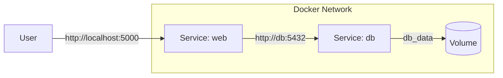

# Wykład 7: Docker Compose – orkiestracja wielu usług

## Czas trwania: 2 godziny

### Agenda:
1. Dlaczego Docker Compose? Definiowanie aplikacji wielokontenerowych.
2. Składnia pliku `docker-compose.yml`.
3. Sieci wewnętrzne Docker (Docker Networks) i komunikacja między kontenerami.
4. Zarządzanie kolejnością uruchamiania usług (depends_on, healthchecks).
5. Wykorzystanie plików `.env` w Docker Compose.
6. Polecenia CLI: up, down, ps, build, restart.

### Treść:

#### 1. Dlaczego Docker Compose?
Ręczne uruchamianie wielu kontenerów (np. aplikacji i bazy danych) za pomocą komendy `docker run` jest uciążliwe i podatne na błędy. Docker Compose pozwala na opisanie całego środowiska w pliku YAML, co gwarantuje powtarzalność i łatwość współdzielenia konfiguracji w zespole.

#### 2. Składnia docker-compose.yml
Plik ten definiuje usługi (services), sieci (networks) oraz wolumeny (volumes).

**Przykład:**
```yaml
version: '3.8'
services:
  web:
    build: .
    ports:
      - "5000:5000"
    depends_on:
      - db
  db:
    image: postgres:15-alpine
    environment:
      POSTGRES_PASSWORD: example_password
```

#### 3. Sieci wewnętrzne i komunikacja
Docker Compose automatycznie tworzy sieć dla Twojej aplikacji.
*   **DNS Resolution:** Kontenery mogą komunikować się ze sobą używając nazw usług zdefiniowanych w pliku YAML jako nazw hostów.
*   **Przykład:** Aplikacja `web` może połączyć się z bazą danych używając adresu `host: db`.



#### 4. Kolejność uruchamiania i Healthchecks
Samo uruchomienie kontenera bazy danych nie oznacza, że jest ona gotowa do przyjmowania połączeń.

*   `depends_on`: Określa kolejność startu, ale nie czeka na pełną gotowość aplikacji.
*   **Healthchecks:** Pozwalają Dockerowi sprawdzić, czy aplikacja wewnątrz kontenera faktycznie działa (np. poprzez zapytanie SQL lub HTTP).

```yaml
services:
  web:
    depends_on:
      db:
        condition: service_healthy
  db:
    image: postgres
    healthcheck:
      test: ["CMD-SHELL", "pg_isready -U postgres"]
      interval: 10s
      timeout: 5s
      retries: 5
```

#### 5. Pliki .env
Aby nie hardkodować haseł i portów w pliku `docker-compose.yml`, używamy plików `.env`.

**Plik .env:**
```env
DB_PASSWORD=supersecret
APP_PORT=8080
```

**Plik docker-compose.yml:**
```yaml
services:
  db:
    environment:
      POSTGRES_PASSWORD: ${DB_PASSWORD}
```

#### 6. Polecenia CLI Docker Compose
*   `docker-compose up -d` – buduje (jeśli trzeba) i uruchamia usługi w tle.
*   `docker-compose down` – zatrzymuje i usuwa kontenery oraz sieci.
*   `docker-compose ps` – wyświetla stan usług zdefiniowanych w pliku.
*   `docker-compose logs -f` – śledzi logi wszystkich usług naraz.
*   `docker-compose exec <service> <command>` – wykonuje polecenie wewnątrz konkretnej usługi.
