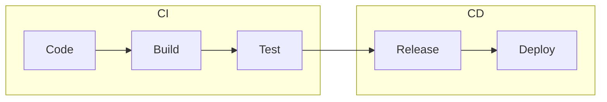

# Wykład 9: Automatyzacja integracji – CI/CD z GitHub Actions w praktyce

## Czas trwania: 2 godziny

### Agenda:
1. Koncepcja Continuous Integration (CI) i Continuous Deployment (CD).
2. GitHub Actions: Reusable Workflows i Composite Actions.
3. Zaawansowana składnia YAML: macierze (strategy matrix), zależności między jobami.
4. Środowiska (Environments) i zatwierdzenia ręczne (Approvals).
5. Zarządzanie sekretami i zmiennymi w GitHub.
6. Monitorowanie przebiegu i rozwiązywanie problemów w Action Logs.

### Treść:

#### 1. Koncepcja CI/CD
Automatyzacja procesów integracyjnych jest kluczowa dla nowoczesnego wytwarzania oprogramowania.

*   **Continuous Integration (CI):** Praktyka regularnego scalania kodu do głównej gałęzi. Każdy "push" wyzwala automatyczne budowanie i testowanie aplikacji. Cel: szybkie wykrywanie błędów.
*   **Continuous Delivery (CD):** Rozszerzenie CI o automatyczne przygotowanie wersji gotowej do wdrożenia (np. obrazu Docker).
*   **Continuous Deployment (CD):** Automatyczne wdrażanie każdej zmiany, która przeszła testy, bezpośrednio na produkcję.



#### 2. Zaawansowane funkcje GitHub Actions
GitHub Actions to potężne narzędzie, które pozwala na budowanie złożonych potoków.

*   **Strategy Matrix:** Pozwala uruchamiać ten sam job na wielu wersjach systemu operacyjnego lub języka jednocześnie.
    ```yaml
    strategy:
      matrix:
        os: [ubuntu-latest, windows-latest]
        python-version: ["3.9", "3.10", "3.11"]
    ```
*   **Needs (Zależności):** Definiowanie kolejności wykonywania jobów. Job `deploy` może zależeć od powodzenia joba `test`.
*   **Reusable Workflows:** Możliwość wywoływania jednego workflow z drugiego, co pozwala na reużywalność kodu CI/CD.

#### 3. Środowiska i Bezpieczeństwo
*   **Environments:** Pozwalają na definiowanie specyficznych ustawień dla różnych etapów (np. `staging`, `production`).
*   **Protection Rules:** Wymaganie ręcznego zatwierdzenia (Approval) przez lidera zespołu przed wdrożeniem na produkcję.
*   **Secrets:** Klucze API, hasła do baz danych – nigdy nie powinny być w kodzie! GitHub Secrets zapewnia ich bezpieczne wstrzykiwanie do potoku.

#### 4. Automatyczne budowanie i wypychanie obrazów Docker
GitHub Actions świetnie integruje się z Docker Hub.

**Kluczowe kroki w workflow:**
1. Logowanie do Docker Hub (używając `Secrets`).
2. Budowanie obrazu (`docker build`).
3. Wypychanie obrazu (`docker push`).

#### 5. Automatyzacja testów i Linters
Zanim kod zostanie zmergowany, system CI powinien sprawdzić:
*   **Unit Tests:** Czy funkcjonalność działa poprawnie.
*   **Linters (np. ESLint, Pylint):** Czy kod jest zgodny ze standardami stylistycznymi.
*   **Security Scanning:** Czy zależności nie mają znanych luk bezpieczeństwa.

#### 6. Wyzwalacze (Triggers)
Workflowy mogą być uruchamiane przez różne zdarzenia:
*   `on: push` – przy każdej zmianie w kodzie.
*   `on: pull_request` – przy próbie scalenia zmian (idealne dla Code Review).
*   `on: schedule` – cyklicznie (np. co noc – nightly builds).
*   `on: workflow_dispatch` – uruchamianie ręczne z interfejsu GitHub.
