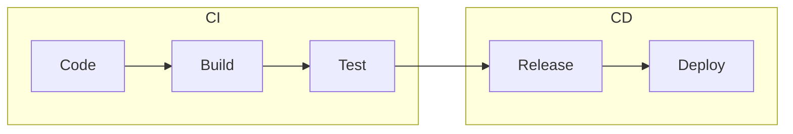

# Wykład 9: Automatyzacja integracji – CI/CD z GitHub Actions

## Czas trwania: 2 godziny

### Agenda:
1. Koncepcja Continuous Integration (CI) i Continuous Deployment (CD).
2. Wprowadzenie do GitHub Actions: Workflows, Jobs, Steps.
3. Składnia YAML dla GitHub Actions.
4. Automatyczne budowanie obrazów Docker i wypychanie do rejestru.
5. Automatyzacja testów i sprawdzanie jakości kodu (Linters).
6. Wyzwalacze (Triggers): push, pull_request, schedule.

### Treść:

#### 1. Koncepcja CI/CD
Automatyzacja procesów integracyjnych jest kluczowa dla nowoczesnego wytwarzania oprogramowania.

*   **Continuous Integration (CI):** Praktyka regularnego scalania kodu do głównej gałęzi. Każdy "push" wyzwala automatyczne budowanie i testowanie aplikacji. Cel: szybkie wykrywanie błędów.
*   **Continuous Delivery (CD):** Rozszerzenie CI o automatyczne przygotowanie wersji gotowej do wdrożenia (np. obrazu Docker).
*   **Continuous Deployment (CD):** Automatyczne wdrażanie każdej zmiany, która przeszła testy, bezpośrednio na produkcję.



#### 2. Wprowadzenie do GitHub Actions
GitHub Actions to narzędzie wbudowane w platformę GitHub, służące do automatyzacji workflowów.

*   **Workflow:** Cały proces zapisany w pliku YAML w katalogu `.github/workflows/`.
*   **Job:** Grupa kroków wykonywanych na tym samym "runnerze" (maszynie wirtualnej). Joby mogą działać równolegle.
*   **Step:** Pojedyncze zadanie, np. uruchomienie komendy shell lub gotowej akcji (Action).

#### 3. Składnia YAML dla GitHub Actions
Przykładowy prosty workflow:

```yaml
name: Node.js CI
on: [push]
jobs:
  build:
    runs-on: ubuntu-latest
    steps:
      - uses: actions/checkout@v3
      - name: Use Node.js
        uses: actions/setup-node@v3
        with:
          node-version: '18'
      - run: npm install
      - run: npm test
```

#### 4. Automatyczne budowanie i wypychanie obrazów Docker
GitHub Actions świetnie integruje się z Docker Hub.

**Kluczowe kroki w workflow:**
1. Logowanie do Docker Hub (używając `Secrets`).
2. Budowanie obrazu (`docker build`).
3. Wypychanie obrazu (`docker push`).

#### 5. Automatyzacja testów i Linters
Zanim kod zostanie zmergowany, system CI powinien sprawdzić:
*   **Unit Tests:** Czy funkcjonalność działa poprawnie.
*   **Linters (np. ESLint, Pylint):** Czy kod jest zgodny ze standardami stylistycznymi.
*   **Security Scanning:** Czy zależności nie mają znanych luk bezpieczeństwa.

#### 6. Wyzwalacze (Triggers)
Workflowy mogą być uruchamiane przez różne zdarzenia:
*   `on: push` – przy każdej zmianie w kodzie.
*   `on: pull_request` – przy próbie scalenia zmian (idealne dla Code Review).
*   `on: schedule` – cyklicznie (np. co noc – nightly builds).
*   `on: workflow_dispatch` – uruchamianie ręczne z interfejsu GitHub.
