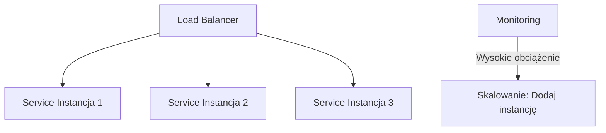

# Wykład 10: Bezpieczeństwo, skalowalność i monitorowanie systemów

## Czas trwania: 2 godziny

### Agenda:
1. Bezpieczeństwo kontenerów i obrazów (skanowanie podatności).
2. Zarządzanie dostępem (IAM) w chmurze i na platformach PaaS.
3. Strategie monitorowania aplikacji i infrastruktury.
4. Logowanie centralne i analiza logów.
5. Skalowanie aplikacji w odpowiedzi na obciążenie.
6. Podsumowanie przedmiotu i trendy w integracji systemów.

### Treść:

#### 1. Bezpieczeństwo kontenerów i obrazów
Bezpieczeństwo w integracji zaczyna się od zaufanego kodu i obrazów.

*   **Skanowanie podatności:** Narzędzia takie jak `Trivy` czy `Snyk` pozwalają na automatyczne wykrywanie znanych luk w bibliotekach systemowych i aplikacyjnych wewnątrz obrazu Docker.
*   **Base Image Security:** Używanie minimalnych obrazów (np. Alpine, Distroless) zmniejsza powierzchnię ataku.
*   **Secret Management:** Nigdy nie przechowujemy haseł w obrazach. Używamy zmiennych środowiskowych i systemów zarządzania sekretami.

#### 2. Zarządzanie dostępem (IAM)
IAM (Identity and Access Management) określa, kto ma dostęp do jakich zasobów.

*   **Zasada najmniejszych uprawnień:** Każda usługa i użytkownik powinni mieć tylko takie uprawnienia, które są niezbędne do wykonania zadania.
*   **RBAC (Role-Based Access Control):** Przypisywanie uprawnień do ról, a nie do konkretnych osób.

#### 3. Strategie monitorowania
Monitorowanie pozwala na proaktywne wykrywanie problemów.

*   **Metryki:** Dane liczbowe zbierane w czasie (zużycie CPU, RAM, liczba zapytań na sekundę, czas odpowiedzi).
*   **Health Checks:** Regularne sprawdzanie, czy usługa "żyje".
*   **Alerting:** Automatyczne powiadamianie zespołu o przekroczeniu progów krytycznych.

#### 4. Logowanie centralne
W rozproszonym systemie (wiele kontenerów) logi muszą trafiać w jedno miejsce.

**Stos ELK / EFK:**
*   **Elasticsearch:** Baza danych do przechowywania i przeszukiwania logów.
*   **Logstash / Fluentd:** Narzędzia do zbierania i przetwarzania logów.
*   **Kibana:** Interfejs graficzny do wizualizacji logów.

#### 5. Skalowanie w odpowiedzi na obciążenie
Systemy zintegrowane muszą dynamicznie reagować na ruch.

*   **HPA (Horizontal Pod Autoscaler):** Automatyczne zwiększanie liczby instancji w zależności od obciążenia CPU.
*   **Load Balancing:** Rozdzielanie ruchu między dostępne instancje.

#### 6. Podsumowanie i trendy
Integracja systemów ewoluuje w stronę:
*   **Serverless:** Skupienie wyłącznie na kodzie, całkowite ukrycie infrastruktury.
*   **Service Mesh:** Zarządzanie komunikacją między mikroserwisami (np. Istio).
*   **GitOps:** Zarządzanie infrastrukturą poprzez repozytorium Git (np. ArgoCD).
*   **AI w DevOps:** Wykorzystanie uczenia maszynowego do przewidywania awarii.
