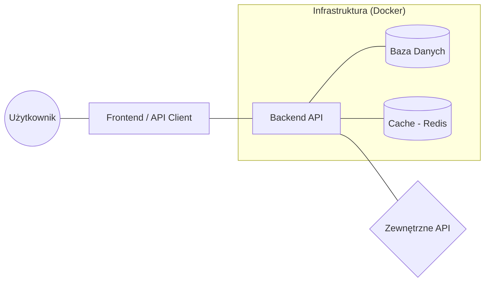
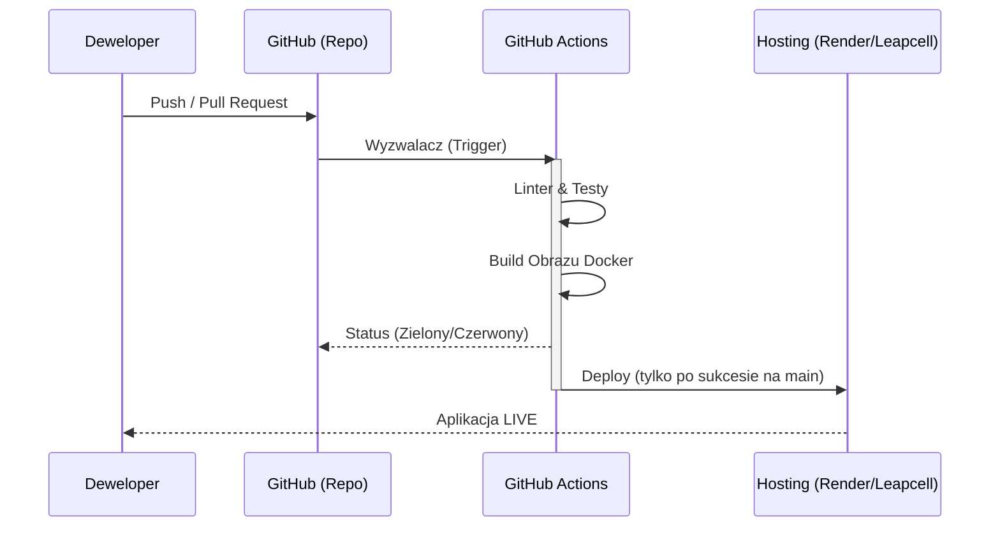

# Projekt końcowy: Zintegrowany System Informatyczny

## Wymiar: 30 godzin

### Cel projektu:
Zaprojektowanie i wdrożenie kompletnego, profesjonalnego systemu informatycznego z wykorzystaniem nowoczesnych praktyk inżynierii oprogramowania. Projekt kładzie szczególny nacisk na integrację systemów, konteneryzację, automatyzację procesów CI/CD oraz zachowanie standardów jakości kodu.

> **Ważne:** Przykłady projektów poniżej bazują na Django, ponieważ jest to technologia wybrana przez prowadzącego do prezentacji. Studenci mogą jednak realizować projekt w dowolnej, preferowanej przez siebie technologii (np. FastAPI, Node.js/Express, Spring Boot, Go).  
> **Skład zespołu**: Projekty mogą być realizowane indywidualnie lub w zespołach dwuosobowych. W przypadku zespołów dwuosobowych oczekiwany jest proporcjonalnie większy zakres funkcjonalny oraz wyraźny podział prac w historii commitów.

| Cecha | Projekt 1-osobowy | Projekt 2-osobowy |
| :--- | :--- | :--- |
| **Liczba funkcjonalności** | Podstawowe (CRUD + 1 Integracja) | Rozszerzone (CRUD + min. 2 Integracje) |
| **Testy** | Min. 60% pokrycia | Min. 75% pokrycia + testy integracyjne |
| **Zadania dodatkowe** | Opcjonalne | Wymagane co najmniej jedno |
| **Code Review** | Nie dotyczy | Wymagane wzajemne recenzje w PR |

---

### 🛠 Standardy i Metodologia (The Twelve-Factor App)

Aplikacja powinna być zaprojektowana w architekturze rozproszonej, gdzie każdy komponent ma jasno określoną rolę.

Oczekuje się, że projekt będzie budowany zgodnie z nowoczesnymi standardami tworzenia aplikacji chmurowych. Sugerowane jest zastosowanie zasad **[The Twelve-Factor App](https://12factor.net/pl/)**, w szczególności:
1.  **Codebase:** Jedno repozytorium śledzone w systemie kontroli wersji, wiele wdrożeń.
2.  **Dependencies:** Jawna deklaracja i izolacja zależności (np. `requirements.txt`, `package.json`, Docker).
3.  **Config:** Przechowywanie konfiguracji w środowisku (zmienne środowiskowe, `.env`), nie w kodzie.
4.  **Backing services:** Traktowanie usług wspierających (bazy danych, cache) jako zasoby dołączane.
5.  **Build, release, run:** Ścisłe rozdzielenie etapów budowania i uruchamiania.
6.  **Statelessness:** Procesy aplikacji powinny być bezstanowe (dane trzymamy w bazie lub storage'u).

---

### Wymagania techniczne i procesowe:

#### 1. System Kontroli Wersji (Git & GitHub):
- **Feature Branch Workflow:** Każda funkcjonalność/poprawka na osobnej gałęzi (`feature/`, `bugfix/`).
- **Pull Requests & Code Review:** Scalanie zmian poprzez PR. W zespołach 2-osobowych wymagane wzajemne recenzje kodu.
- **Kultura commitów:** Atomowe commity, wiadomości zgodne z [Conventional Commits](https://www.conventionalcommits.org/).
- **GitHub Issues/Projects:** Zarządzanie zadaniami przy użyciu narzędzi GitHub (opcjonalne, ale wysoko oceniane).

#### 2. Automatyzacja (GitHub Actions):

Poniższy diagram przedstawia automatyczny proces weryfikacji i wdrożenia kodu:

- **Continuous Integration (CI)**:
  - Automatyczne uruchamianie testów jednostkowych i integracyjnych.
  - Statyczna analiza kodu (Linters: `flake8`, `pylint`, `eslint` itp.).
  - Budowanie obrazu Dockera w celu weryfikacji poprawności `Dockerfile`.
- **Continuous Deployment (CD)**:
  - Automatyczne wdrożenie na produkcję (Render, Leapcell, Railway, Fly.io) po scaleniu do `main`.

#### 3. Dokumentacja (Markdown):
- **README.md**: Profesjonalny plik zawierający opis, stos technologiczny, instrukcję uruchomienia (Docker), schemat bazy danych/architektury oraz link do wersji live.
- **API Documentation**: Jeśli projekt to API, wymagana dokumentacja endpointów (np. Swagger/OpenAPI lub czytelna lista w Markdown).

---

### 📋 Scenariusze Projektowe (Inspiracje):
*Tematy różnią się od zadań laboratoryjnych, wymagając szerszego spojrzenia na logikę biznesową.*

#### 1. System Rezerwacji Zasobów (np. Co-working, Sprzęt, Gabinety)
**Cel:** Zarządzanie dostępnością ograniczonych zasobów w czasie.
- **Kluczowe funkcje:** Kalendarz rezerwacji, unikanie nakładania się terminów (logika walidacji), profile użytkowników, powiadomienia o statusie rezerwacji.
- **Integracja:** System wysyłki powiadomień (np. Email przez SendGrid/Mailgun lub integracja z Slack).
- **Zadanie inżynierskie:** Implementacja blokowania zasobu w bazie danych na czas transakcji.

#### 2. Portal E-learningowy / Kursy Online
**Cel:** System zarządzania treścią edukacyjną i postępami studentów.
- **Kluczowe funkcje:** Podział na moduły i lekcje, śledzenie postępu (ukończone lekcje), system quizów z automatycznym sprawdzaniem wyników.
- **Integracja:** Przechowywanie plików multimedialnych (np. integracja z AWS S3 lub Cloudinary).
- **Zadanie inżynierskie:** Optymalizacja zapytań SQL do wyliczania statystyk postępu dla wielu użytkowników.

#### 3. Agregator Danych Finansowych / Kryptowalutowych
**Cel:** System monitorujący portfel inwestycyjny użytkownika w oparciu o dane rynkowe.
- **Kluczowe funkcje:** Pobieranie aktualnych kursów z zewnętrznych API (np. CoinGecko, NBP), przeliczanie wartości portfela, historia zmian wartości w czasie.
- **Integracja:** Cykliczne pobieranie danych w tle (np. GitHub Actions Scheduled Triggers lub Celery/Redis).
- **Zadanie inżynierskie:** Obsługa limitów (Rate Limiting) zewnętrznych API i cachowanie wyników.

#### 4. System Zarządzania Magazynem (Inventory Management System)
**Cel:** Kontrola stanów magazynowych, dostaw i wydań produktów.
- **Kluczowe funkcje:** Obsługa kodów SKU, alerty o niskim stanie produktów, generowanie raportów w formacie PDF/CSV.
- **Integracja:** Integracja z zewnętrznym API kurierskim (symulacja) lub generowanie kodów QR.
- **Zadanie inżynierskie:** Zarządzanie współbieżnością przy jednoczesnej aktualizacji stanu magazynowego przez wielu użytkowników.

---

### ✅ Rozszerzona Lista Kontrolna (Checklist):

#### Faza 1: Architektura i Setup
- [ ] Repozytorium skonfigurowane z odpowiednim `.gitignore` i licencją.
- [ ] Wybrana architektura i stos technologiczny (opisane w README).
- [ ] Skonfigurowane zmienne środowiskowe (przykład w `.env.example`).
- [ ] Zaprojektowany schemat bazy danych (diagram ERD lub opis relacji).

#### Faza 2: Implementacja i Jakość
- [ ] Logika biznesowa pokryta testami jednostkowymi (min. 60-70% coverage).
- [ ] Obsługa błędów (Error Handling) – aplikacja nie "wywala się" przy błędnym wejściu.
- [ ] Walidacja danych po stronie serwera.
- [ ] Kod zgodny ze standardami (brak "magic numbers", opisowe nazwy zmiennych, brak martwego kodu).

#### Faza 3: Konteneryzacja i Infrastruktura
- [ ] `Dockerfile` zoptymalizowany pod kątem rozmiaru (multi-stage build lub obrazy `slim`/`alpine`).
- [ ] `docker-compose.yml` zawiera aplikację, bazę danych oraz ewentualne usługi (Redis, Worker).
- [ ] Zdefiniowane Healthchecki w kontenerach.

#### Faza 4: CI/CD i Bezpieczeństwo
- [ ] Pipeline CI uruchamia lintery i testy przy każdym PR.
- [ ] Pipeline CD wdraża aplikację automatycznie tylko po sukcesie CI.
- [ ] Brak wrażliwych danych (klucze API, hasła) w repozytorium.
- [ ] Zabezpieczenie przed typowymi atakami (np. SQL Injection, XSS) – korzystanie z mechanizmów frameworka.

---

### 🌟 Zadania Dodatkowe (Dla chętnych - Bonus Points):
1.  **Caching:** Implementacja warstwy cache (np. Redis) dla najczęściej wywoływanych zapytań.
2.  **Monitorowanie:** Podpięcie prostego monitoringu (np. Sentry do błędów lub UptimeRobot).
3.  **Authentication Extra:** Logowanie przez zewnętrzne serwisy (OAuth2 - GitHub, Google).
4.  **Full Search:** Implementacja wyszukiwania pełnotekstowego (np. PostgreSQL Full Text Search).
5.  **Performance:** Optymalizacja obrazów Dockera (zmniejszenie rozmiaru o >30%).
6.  **Background Tasks:** Przetwarzanie asynchroniczne zadań (np. wysyłka maili w tle).

---

### Wymagania na zaliczenie:
- Repozytorium na GitHub z pełną historią zmian (znaczące commity).
- Działająca aplikacja (link do wersji chmurowej).
- Poprawnie skonfigurowany i "zielony" potok CI/CD.
- Prezentacja projektu (demo) oraz obrona techniczna (pytania o architekturę i integrację).
